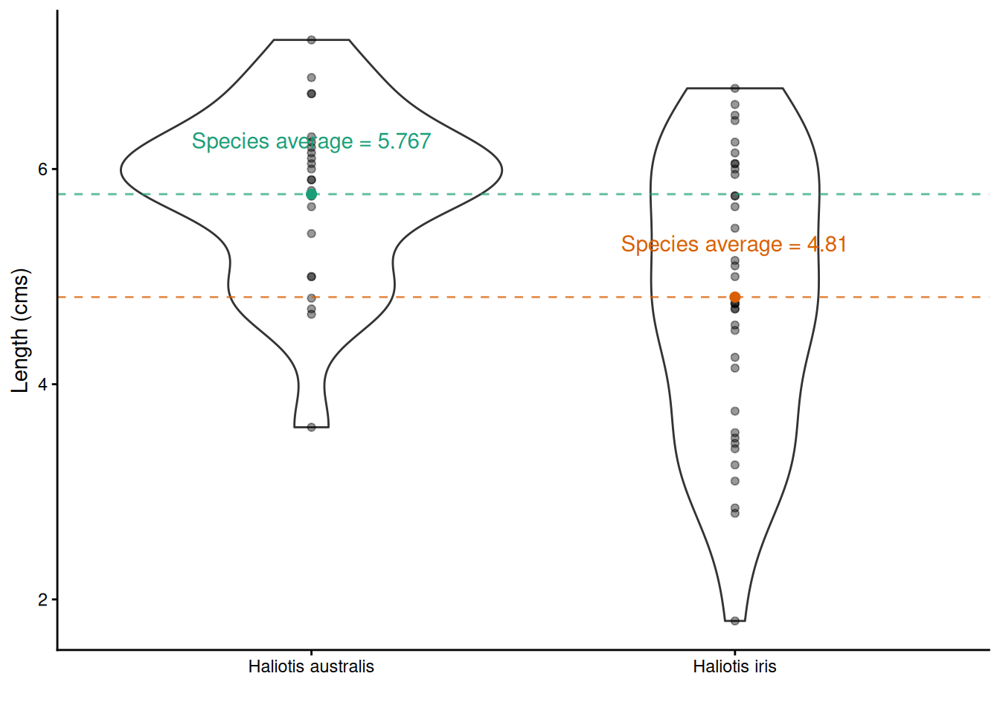
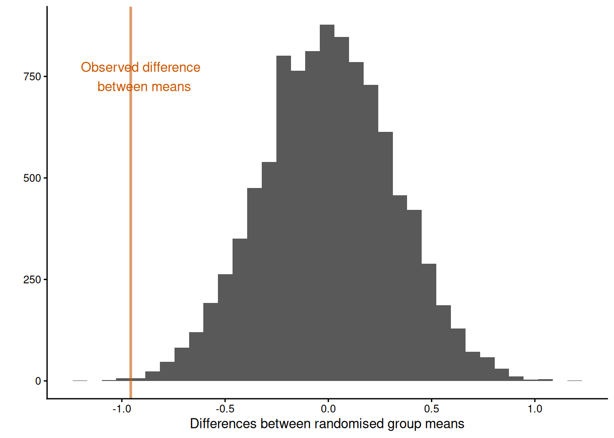
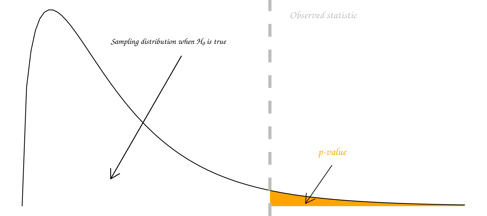

# Introduction to Hypothesis testing

<div class="alert alert-success" role="alert">
<center>{width=10%}</center>

<strong>Learning objectives</strong>

<ul>
<li> Formulate a question/hypothesis to investigate based on the given data </li>
<li> Write out the appropriate null and alternative hypothesis using statistical notation for a randomization test (given a statistic) </li>
<li> Given a statistic write `R` code to carry out a randomization test</li>
<li> Correctly interpret and communicate a p-value in terms of a randomization test</li>
<li> Define the meaning of false positive (Type I error) and false negative (Type II error) effects in terms of a hypothesis test </li>
<li> State in terms of probability statements the meaning of the power and significance level of an hypothesis test</li>

</ul>
</div>

We saw in the previous chapter (in [Setting up an experiment]) that a hypothesis often serves as the foundation for designing experiments and therefore collecting data. A hypothesis should be specific and testable (i.e., we should be able to collect evidence either in support of or against the hypothesis). Hypotheses should mention measurable variables; typically a dependent/response variable (the outcome being measured) and one or more independent/treatment variables (being manipulated or studied).

Once we have specified our hypothesis we want to test it! That is find evidence for or against it. To do so reliably we need to use rigorous statistical methodology. In this section you will be (re)introduced^[if you did  STATS10X then you have already covered randomization tests.] to a straightforward, yet hugely powerful statistical tool: randomization tests!

## Randomization tests

The basic approach to a randomization test is straightforward:

 1. Choose a statistic to measure the effect in question (e.g., differences between group means)
 2. Calculate that test statistic on the observed data. Note this metric can be **anything** you wish
 3. Construct the sampling distribution that this statistic would have if the effect were not present in the population (i.e., the distribution under the *Null* hypothesis, $H_0$): For a chosen number of times
    + shuffle the data labels
    + calculate the test statistic for the reshuffled data and retain
 4. Find the location of your observed statistic in the sampling distribution. The location of observed statistic in sampling distribution is informative:
   + if in the main body of the distribution then the observed statistic could easily have occurred by chance
   + if in the tail of the distribution then the observed statistic would rarely occur by chance and there is evidence that something other than chance is operating.
 5. Calculate the proportion of times your reshuffled statistics equal or exceed the observed. This *p-value* is the probability that we observe a statistic at least as “extreme” as the one we observed **State** the strength of evidence against the null on the basis of this **probability**.
 
<div class="alert alert-warning">
  <strong>TASK</strong> Briefly outline what effect your choice of *a chosen number of times* has on your randomization test.
 </div>

 
### A randomization test for two independent samples

Remember the Pāua data from earlier in the module? This dataset contains the following variables

 + `Age` of  P$\overline{\text{a}}$ua in years (calculated from counting rings in the cone) 
 + `Length` of  P$\overline{\text{a}}$ua shell in centimeters
 + `Species` of  P$\overline{\text{a}}$ua: *Haliotis iris* (typically found in NZ) and
*Haliotis australis* (less commonly found in NZ) 

We can read these data directly into R using the URL and the `readr` package, which is part of the `tidyverse` collection) as follows.


``` r
paua <- readr::read_csv("https://raw.githubusercontent.com/STATS-UOA/databunker/master/data/paua.csv")
```


``` r
glimpse(paua)
```

```
## Rows: 60
## Columns: 3
## $ Species <chr> "Haliotis iris", "Haliotis australis", "Haliotis australis", "…
## $ Length  <dbl> 1.80, 5.40, 4.80, 5.75, 5.65, 2.80, 5.90, 3.75, 7.20, 4.25, 6.…
## $ Age     <dbl> 1.497884, 11.877010, 5.416991, 4.497799, 5.500789, 2.500972, 6…
```

**One question we may want to ask is if, on average, the shell length differs between Species?** 

We would formulate this as a hypothesis test as follows

 + **Null hypothesis**: The mean length of *Haliotis iris* shells is the same as *Haliotis australis*
 + **Alternative hypothesis**: The mean length of *Haliotis iris* shells is not the same as *Haliotis australis*
 + **Test statistic**: Difference of sample means
 
Now, statisticians love using Greek letters to symbolize things. Typically, the letter $\mu$ is used to represent a mean. So, by letting $\mu_\text{Haliotis iris}$ represent the average shell length of *Haliotis iris* and 
$\mu_\text{Haliotis australis}$ represent the average shell length of *Haliotis australis*  we could synthase this hypothesis test as


 + **Null hypothesis**: $\mu_\text{Haliotis iris} = \mu_\text{Haliotis australis}$
 + **Alternative hypothesis**: $\mu_\text{Haliotis iris} \neq \mu_\text{Haliotis australis}$
 + **Test statistic**: $\mu_\text{Haliotis australis} - \mu_\text{Haliotis iris}$ (or $\mu_\text{Haliotis iris} - \mu_\text{Haliotis australis}$ it doesn't matter here)

Finally, not having had enough of mathematical syntax quite yet by convention a Null hypothesis is denoted $\text{H}_0$ and an alternative hypothesis by $\text{H}_1$. So our hypothesis test can finally be written concisely as

$\text{H}_0:$ $\mu_\text{Haliotis iris} = \mu_\text{Haliotis australis}$ vs $\text{H}_1:$ $\mu_\text{Haliotis iris} \neq \mu_\text{Haliotis australis}$

It follows from this definition that out test statistic is $\mu_\text{Haliotis australis} - \mu_\text{Haliotis iris}$. The *vs* is convention as we are considering two opposing hypotheses.


Having, defined the hypothesis test above what would you expect the answer to be looking at the plot below?




#### 1. Choose a statistic that measures the effect of interest (in this case the differences between means) {-}


``` r
## observed differences in means
diff_in_means <- paua %>% 
  group_by(Species) %>% 
  summarise(mean = mean(Length)) %>%
  summarise(diff = diff(mean)) %>% as.numeric()
diff_in_means
```

```
## [1] -0.9569444
```

#### 2. Construct the sampling distribution that this statistic would have if the effect were not present in the population (i.e., the distribution under $H_0$) {-}
 

``` r
## Number of times I want to randomize
nreps <- 9999  
## initialize empty array to hold results
randomisation_difference_mean <- numeric(nreps)
set.seed(1234) ## *****Remove this line for actual analyses*****
## This means that each run with produce the same results and
## agree with the printout that I show.

for (i in 1:nreps) {
  ## the observations
  data <- data.frame(value = paua$Length)
  ##  randomize labels
  data$random_labels <-sample(paua$Species, replace = FALSE)
  ## randomized differences in mean
  randomisation_difference_mean[i] <- data %>% 
    group_by(random_labels) %>% summarise(mean = mean(value)) %>% 
    summarise(diff = diff(mean)) %>% as.numeric()
}
## results, combine with the observed statistic
results <- data.frame(randomisation_difference_mean = c(diff_in_means, randomisation_difference_mean))
```

#### 3. Locate the observed statistic (i.e., from our observed random sample) in the sampling distribution {-}

The location of observed statistic in the sampling distribution allows us to draw inference with regards to our hypothesis.

If the observed statistic is in the main body of the distribution then it is more than likely that the observed statistic occurred by chance. However, if the observed statistic is in the tail of the distribution then it would rarely occur by chance and we have evidence against the observed statistic occurring by chance alone.


``` r
## How many randomized differences in means are as least as extreme as the one we observed
## absolute value as dealing with two tailed
n_exceed <- sum(abs(results$randomisation_difference_mean) >= abs(diff_in_means))
n_exceed
```

```
## [1] 18
```

We see something as least as extreme as our observed test statistic 18 times. This translates to a two-sided tail proportion of 0.0018. The plot below illustrates the location of the observed test statistic in that of the distribution of the test statistics we calculated under the null hypothesis.


```
## Warning: Using `size` aesthetic for lines was deprecated in ggplot2 3.4.0.
## ℹ Please use `linewidth` instead.
## This warning is displayed once per session.
## Call `lifecycle::last_lifecycle_warnings()` to see where this warning was
## generated.
```




In experimental situations a large p-value (large tail proportion) means that the luck of the randomization quite often produces group differences as large or even larger than what we've got in our data. A small p-value means that the luck of the randomization draw hardly ever produces group differences as large as we've got in our data. **So what do you conclude here?**

**NOTE: We can extend the randomization test to make inference about any sample statistic (not just the mean)**

<div class="alert alert-warning">
  <strong>TASK</strong> Run through the code chunks above but change your code accordingly so that your hypothesis test is now 
  
 + **Null hypothesis**: On average, the Age of *Haliotis iris* is the same as *Haliotis australis*
 + **Alternative hypothesis**: On average, the Age of *Haliotis iris* is not the same as *Haliotis australis*
 + **Test statistic**: Difference of sample means
 
What do you conclude?
 </div>
 
 
 <div class="alert alert-warning">
  <strong>TASK</strong> Run through the code chunks above but change your code accordingly so that your hypothesis test is now 

 + **Null hypothesis**: The median length of *Haliotis iris* shells is the same as *Haliotis australis*
 + **Alternative hypothesis**: The median length of *Haliotis iris* shells is not the same as *Haliotis australis*
 + **Test statistic**: Difference of sample medians
 
What do you conclude?
 </div>

## What is a  *p-value*?

> "Good statistical practice, as an essential component of good scientific practice, 
emphasizes principles of good study design and conduct, a variety of numerical 
and graphical summaries of data, understanding of the phenomenon under study, 
interpretation of results in context, complete reporting and proper
logical and quantitative understanding of what data summaries mean. 
No single index should substitute for scientific reasoning." <footer class="blockquote-footer" style="text-align: right;">ASA Statement on p-Values</footer>

Informally, a p-value is the probability under a specified statistical model that a statistical summary of the data (e.g., the sample mean difference between two compared groups) would be equal to or more extreme than its observed value.

There are **many** different schools of thought about how a p-value should be interpreted.

Most people agree that the p-value is a useful measure of the strength of evidence against the null hypothesis. The smaller the p-value, the stronger the evidence against $H_0$. 

Some people go further and use an accept/reject framework. Under this framework, the null hypothesis $H_0$ should be rejected if the p-value is less than 0.05 (say), and accepted if the p-value is greater than 0.05. In this course we mostly use the strength of evidence interpretation. The p-value measures how far out our observation lies in the tails of the distribution specified by $H_0$:




In summary, **p-values** can indicate how incompatible the data are with a specified statistical model; they **do not** measure the probability that the studied hypothesis is true, or the probability that the data were produced by random chance alone.

Note that a p-value does **not** measure the size of an effect or the importance of a result and by itself it does **not** provide a good measure of evidence regarding a model or hypothesis. Note also, that a substantial evidence of a difference does **not** equate to evidence of a substantial difference! Any scientific conclusions and business or policy decisions **should not** be based only on whether a p-value passes a specific threshold as proper inference requires **full** reporting and transparency. 

Remember that **statistical significance does not imply practical significance**, and that **statistical significance says nothing about the size of treatment differences.** To estimate the sizes of differences you need confidence intervals, look out for these in the following chapters. 


**Some p-value threshold recursive FAQs**

| Question                                                         | Answer                                                                     |
|------------------------------------------------------------------|----------------------------------------------------------------------------|
| **Why do so many colleges and grad schools teach *p-val*=0.05?** | Because that's still what the scientific community and journal editors use.  **BUT IT SHOULDN'T BE** |

| **Why do so many people still use *p-val*=0.05?**             | Because that's what they were rote taught in college or grad school. **BUT THEY SHOULDN'T BE** |


<div class="alert alert-warning">
  <strong>TASK</strong> Briefly outline why a threshold cutoff is problematic in the context of hypothesis testing
 </div>

## The vocabulary of hypothesis testing


> "Type I Zoom error: you think people can hear you, but you’re actually on mute.  Type II Zoom error: you think your muted, but actually people can hear you." <footer class="blockquote-footer" style="text-align: right;">@CynPeacock, Twitter</footer>


|State of Nature  | Don't reject $H_0$ | reject $H_0$ |
|---              |---                |---            |
| $H_0$ is true |  <i class="fa fa-check icon"></i> | Type I error  |
| $H_0$ is false  | Type II error  | <i class="fa fa-check icon"></i> |


**Type I errors**

A **Type I** error (false positive): declare a difference (i.e., reject $H_0$) when there is no difference (i.e. $H_0$ is true). Risk of the Type I error is determined by the *level of significance* (which we set!) (i.e., $\alpha =\text{ P(Type I error)} = \text{P(false positive)}$.

<p align="center"></p>

**Type II**

A **Type II** error (false negative): difference not declared (i.e., $H_0$ not rejected) when there is a difference (i.e., $H_0$ is false). Let $\beta =$ P(do not reject $H_0$ when $H_0$ is false); so, $1-\beta$ = P(reject $H_0$ when $H_0$ is false) = P(a true positive), which is the statistical **power** of the test.

<p align="center"></p>

**Significance level**

The **significance level** is the probability of a Type I error (i.e., the probability of finding an effect that is not there, a false positive).

**Power**

The **power** of a test is the probability that the test correctly rejects the null hypothesis when the alternative hypothesis is true. The probability of finding an effect that is there =  1 - probability of a **Type II** error (false negative).

Reducing the chance of a **Type I** error increases the chance of a **Type II** error. They are inversely related. **Type II** error rate is determined by a combination of the following.

  + **Effect size** (size of difference, of biological significance) between the true population parameters
  + Experimental error variance 
  + **Sample size**
  + Choice of **Type I** error rate ($\alpha$)

**Family-Wise Error Rate (FWER)**

**Each** time we carry out a hypothesis test the probability we get a false positive result (type I error) is given by $\alpha$ (the *level of significance* we choose).

When we have **multiple comparisons** to make we should then control the **Type I** error rate across the entire *family* of tests under consideration, i.e., control the **Family-Wise Error Rate (FWER)**; this ensures that the risk of making at least one **Type I** error among the family of comparisons in the experiment is $\alpha$. 


<div class="alert alert-info" role="alert">
{width=10%} 

<strong>Other resources: optional but recommended</strong>

<ul>
<li>[Cheat sheet: randomisation explained by cows...](https://biosci738.github.io/cowstats/#/section-2) </li>
<li>[The ASA Statement on p-Values: Context, Process, and Purpose](https://www.tandfonline.com/doi/full/10.1080/00031305.2016.1154108)</li>
</ul>
</div>
