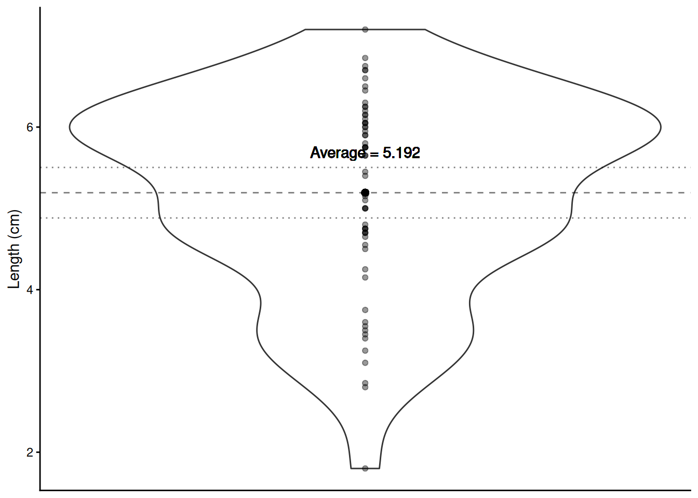
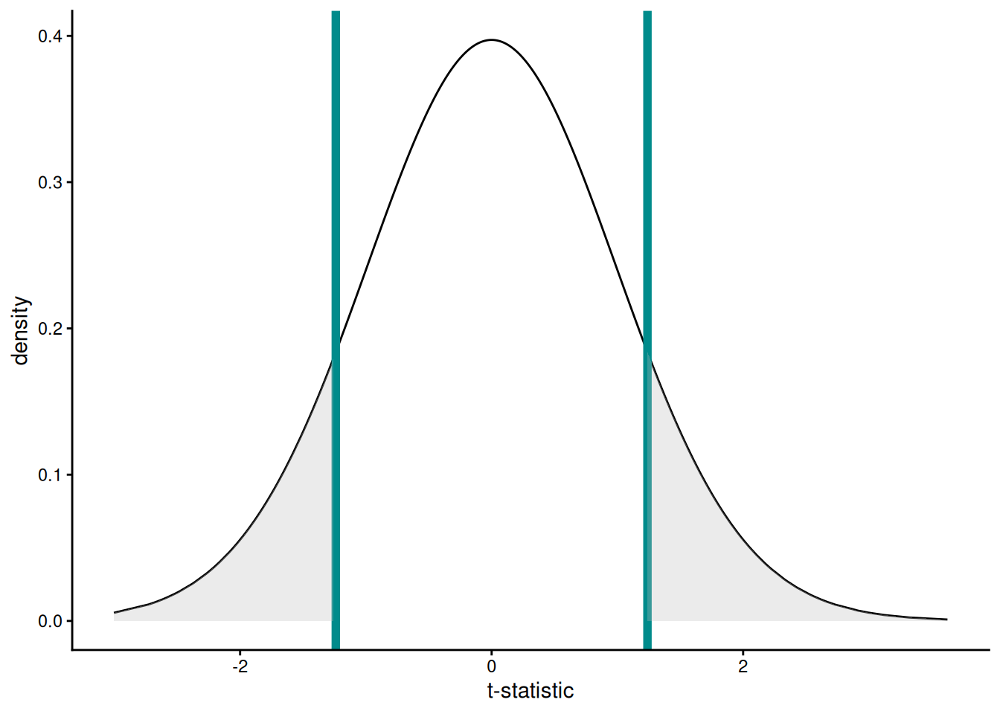
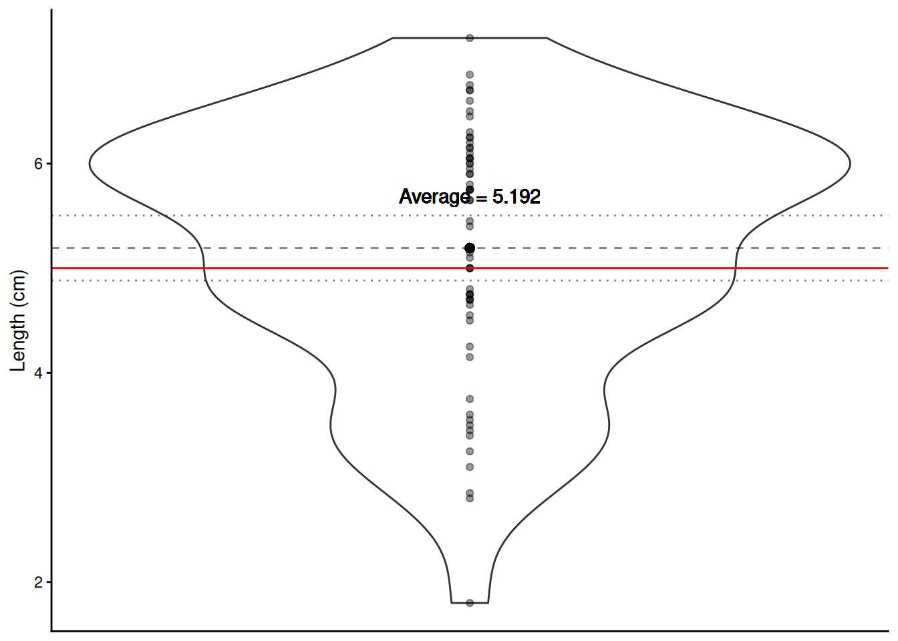
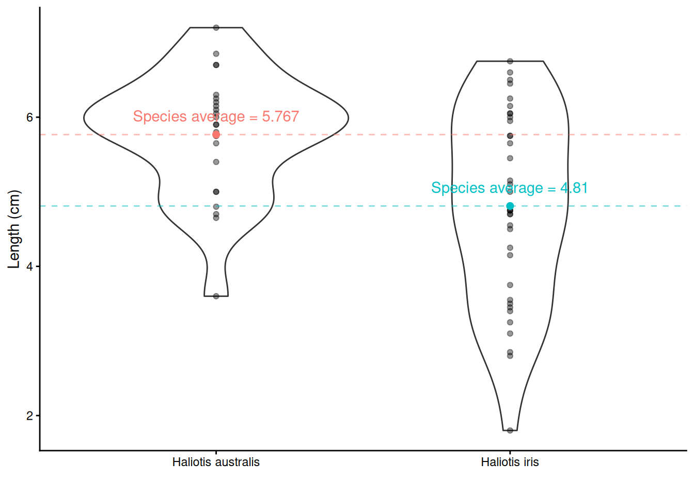
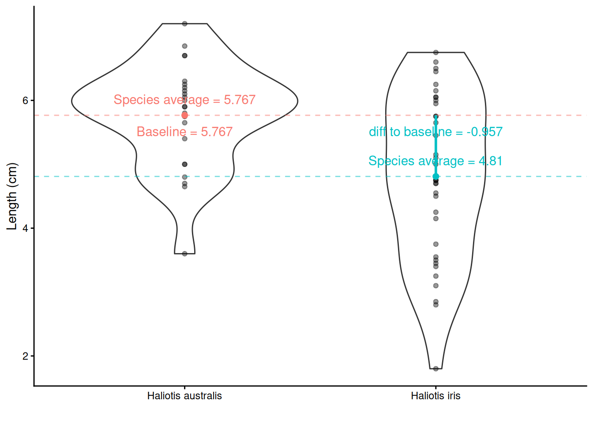
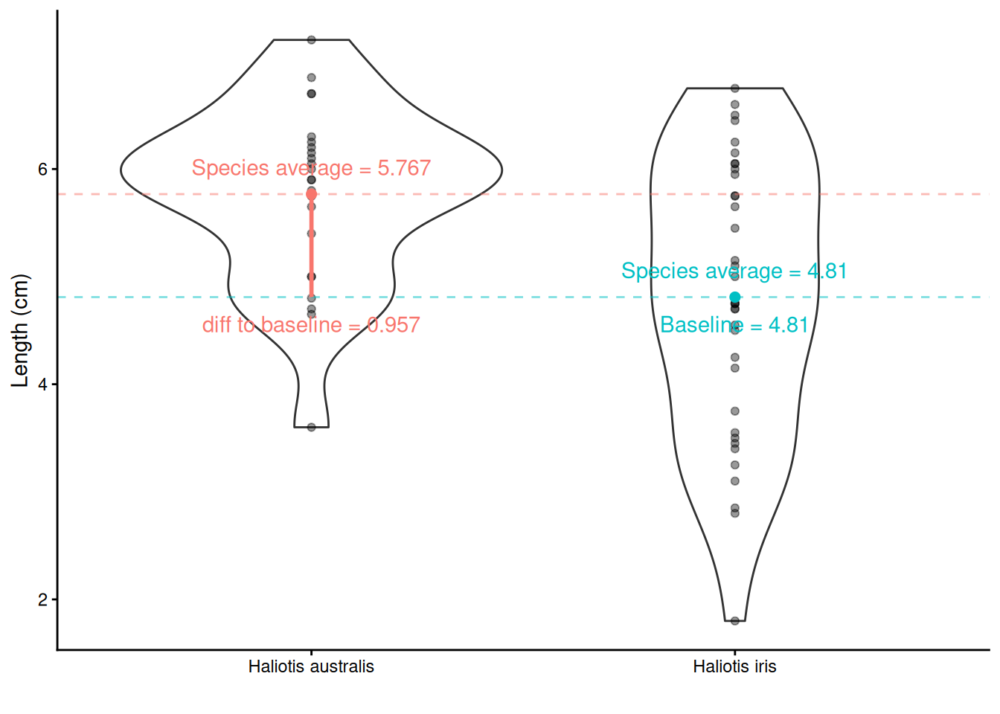
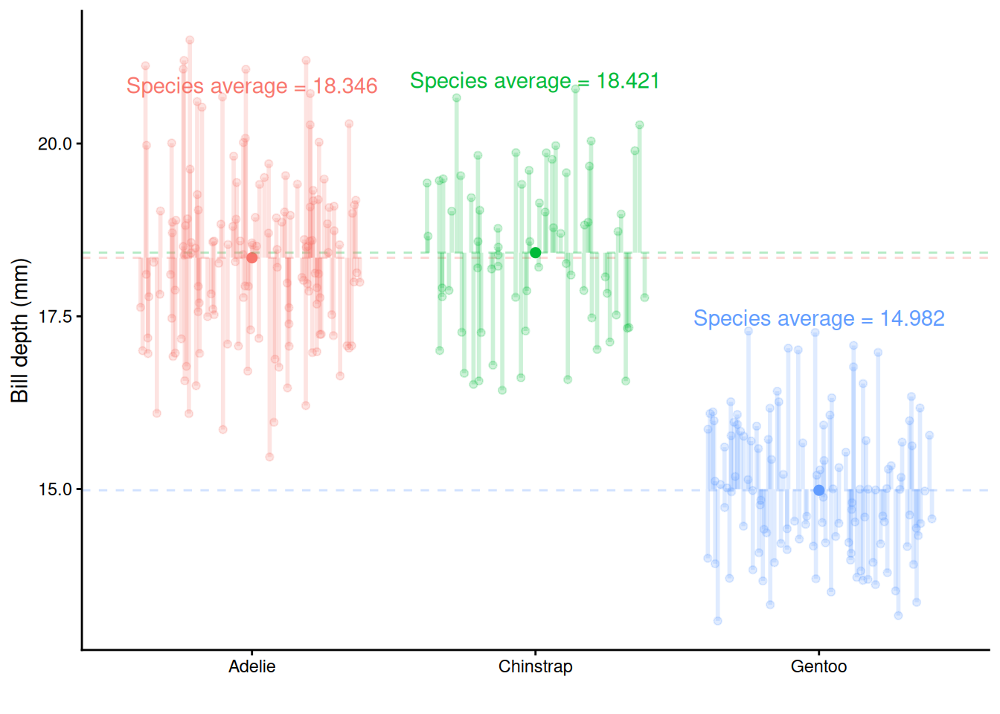
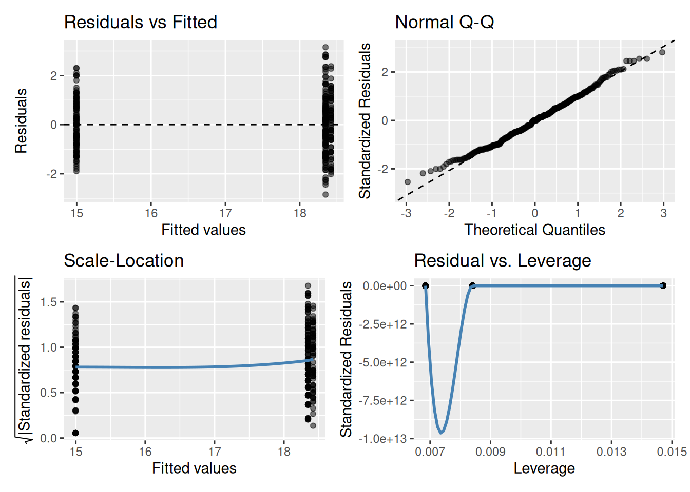

# Hypothesis testing and introduction to linear regression

<div class="alert alert-success" role="alert">
<center>{width=10%}</center>

<strong>Learning outcomes</strong>

<ul>
  <li>Describe the difference between a scientific hypothesis and statistical hypotheses (H~0~ and H~1~/H~A~)</li>

  <li>
    Apply the four steps of hypothesis testing, write `R` code and interpret `R` outputs for
    <ul>
      <li>one-sample t-test</li>
      <li>two-sample independent t-test</li>
      <li>one-way Analysis of Variance (ANOVA)</li>
    </ul>
  </li>

  <li>Identify similarities of hypothesis tests listed above to simple linear regression</li>

  <li>List linear regression model assumptions and be able to evaluate model diagnostics to assess model suitability</li>
</ul>

</div>

## Hypothesis testing

### Scientific vs statistical hypotheses

**Scientific/Research hypotheses** are expected or predicted relationships between two or more variables that motivate a piece of research. They stem from the research question and often are developed from prior knowledge or theoretical expectation. 

**Statistical hypotheses** involve restating the research hypothesis so it can be addressed by statistical techniques, such as hypothesis testing. For hypothesis testing, two statistical hypotheses are presented:

+ **Null hypothesis H~0~**
     + It is the "no news here" hypothesis.
     + It is always specific; it identifies one particular value for the parameter of interest.
     + Usually it is there is no difference, no relationship, no effect (i.e., usually = 0).
     + Most often it would be interesting to find evidence against the null hypothesis.
     + This the only hypothesis that is actually being tested when we conduct a hypothesis test.
+ **Alternative hypothesis H~1~/H~A~**
     + It is the "new news" hypothesis. 
     + It is the opposite of the null, often everything that isn't the null hypothesis.
     + There is a difference, a relationship, an effect (i.e. usually $\neq$ 0).
     + The alternative contains possibilities that would be more biologically interesting than what is stated in the null hypothesis.
     + The alternative also often contains values that are predicted in the scientific hypothesis being evaluated by the statistical test, so the researcher often hopes to find evidence against the null hypothesis. 
     
### Four basic steps of hypothesis testing

**1. State the hypotheses**\
**2. Compute the test statistic**\
**3. Determine the p-value**\
**4. Draw the appropriate conclusions**

Actually, there is a couple of initial things to do before step 1. These are to determine what type of statistical test you will conduct (based off what metric you wish to measure and your scientific hypothesis and data - see lecture and Hypothesis testing H5P for more information) and check to make sure the assumptions of said test are met. If assumptions are not met, you’ll need to adjust the test you conduct. We’ll go over model assumptions and model diagnostics in lecture and later in this guide.

We'll go through all the steps of hypothesis testing by going through some worked examples. We will, again, use the `paua.csv` data, available from CANVAS and [earlier in this course guide](https://biosci220.github.io/BIOSCI220/r-and-rstudio-1.html#dealing-with-data). Recall that the P$\overline{\text{a}}$ua dataset contains the following variables:

 + `Age` of  P$\overline{\text{a}}$ua in years (calculated from counting rings in the cone) 
 + `Length` of  P$\overline{\text{a}}$ua shell in centimetres
 + `Species` of  P$\overline{\text{a}}$ua: *Haliotis iris* (Blackfoot p$\overline{\text{a}}$ua) and
*Haliotis australis* (Yellowfoot p$\overline{\text{a}}$ua) - both endemic to NZ


``` r
library(tidyverse)
paua <- read_csv("paua.csv")
```

It is a good idea to check our data set has imported into `R` correctly and is how we expect it to look


``` r
glimpse(paua)
```

```
## Rows: 60
## Columns: 3
## $ Species <chr> "Haliotis iris", "Haliotis australis", "Haliotis australis", "…
## $ Length  <dbl> 1.80, 5.40, 4.80, 5.75, 5.65, 2.80, 5.90, 3.75, 7.20, 4.25, 6.…
## $ Age     <dbl> 1.497884, 11.877010, 5.416991, 4.497799, 5.500789, 2.500972, 6…
```

### One-Sample t-test

Using a violin plot we can look at the distribution of shell `Length` (i.e., one variable hence a one-sample t-test will be used). We can calculate the average `Length` of all shells in our sample.


``` r
paua %>% summarise(average_length = mean(Length))
```

```
## # A tibble: 1 × 1
##   average_length
##            <dbl>
## 1           5.19
```


```
## Warning in geom_point(aes(x = 1, y = mean(Length)), size = 2): All aesthetics have length 1, but the data has 60 rows.
## ℹ Please consider using `annotate()` or provide this layer with data containing
##   a single row.
```

```
## Warning in geom_text(aes(x = 1, y = mean(Length) + 0.5, label = paste0("Average = ", : All aesthetics have length 1, but the data has 60 rows.
## ℹ Please consider using `annotate()` or provide this layer with data containing
##   a single row.
```


What about drawing inference? *Do we believe that the average length of P$\overline{\text{a}}$ua shells is, say, 5cm (perhaps some previous research suggests this value)?* This is our research question. Let's turn this into statistical hypotheses that we can test.

#### Step one. State the hypotheses

 + *Null hypothesis:* On average P$\overline{\text{a}}$ua shells are 5 cm long
 + *Alternative hypothesis*: On average P$\overline{\text{a}}$ua shells are **not** 5 cm long
 + *Notationally*: $H_0: \mu = 5$ vs $H_1: \mu \neq 5$ (*$\mu$ is the proposed population mean*)

#### Step two. Compute the test statistic

We know our sample average (5.192 cm), but can we make any claims based on this one number? Other useful information to help us reflect the uncertainty about our sample mean is the spread/variability of data around this mean.

**Visualising the uncertainty in a one-sample t-test - the SEM**

The Standard Error of the Mean (SEM) is a measure of uncertainty about the mean. We can visualise this uncertainty by adding error bars around the sample mean on our violin plot. Typically $\pm$ twice the SEM is the interval used:


```
## Warning in geom_point(aes(x = 1, y = mean(Length)), size = 2): All aesthetics have length 1, but the data has 60 rows.
## ℹ Please consider using `annotate()` or provide this layer with data containing
##   a single row.
```

```
## Warning in geom_text(aes(x = 1, y = mean(Length) + 0.5, label = paste0("Average = ", : All aesthetics have length 1, but the data has 60 rows.
## ℹ Please consider using `annotate()` or provide this layer with data containing
##   a single row.
```



*Why error bars that are $\pm$ twice the SEM?*
This is approximately the 95% confidence interval for the population mean.

We can use the in-built functions in `R` to calculate the mean and the SEM. Yay - we don't have to do these calculations by hand, `R` can do them for us! For the `paua` data, here's some code we can use:


``` r
sem <- paua %>% summarise(mean = mean(Length),
                   sem = sd(Length)/sqrt(length(Length)))
sem
```

```
## # A tibble: 1 × 2
##    mean   sem
##   <dbl> <dbl>
## 1  5.19 0.155
```

Note: have you noticed the font in the code above is coloured differently? The <span style="color: MidnightBlue;">dark blue font indicates an `R` function to do a calculation</span>, the <span style="color: OliveDrab;">green font indicates the name of an object being created. Try to change these and see what the headers of the tibble output change to</span>, and `Length` in black font is the variable in the `paua` data set that we want to summarise. (you will not see the colours if you are reading this course guide printed in black and white).


**The test statistic is a way of summarising the sample mean and its uncertainty into a single number. For a t-test, the test statistic is the t-statistic or the t-value.**

The t-statistic for a one-sample t-test is:

t-statistic $= \frac{\bar{x}- \mu}{\text{SEM}}$ = $\frac{5.1925 - 5}{0.155351}$ = 1.239

+ $\bar{x}$ is the sample mean

+ $\mu$ is the theoretical value (*proposed population mean*)
   
+ SEM is the Standard Error of the Mean. **SEM**  $= \frac{\sigma}{\sqrt{n}}$; where $\sigma$ is a population parameter that we estimate using our sample standard deviation (SD). $SD  = \sqrt{\frac{\sum_{i = 1}^n(x_i - \bar{x})^2}{n-1}}$ ($i = 1,...,n$) is the standard deviation (SD) of the sample, $n$ is the sample size, and $\bar{x}$ is the sample mean. (*to learn more about how this is calculated, see "Other resources:optional but recommended" at the end of this section*)
   
We want to compare this t-statistic to the **null distribution**, which is the most likely range of values that will occur if we assume the null hypothesis is true (`R` can create this null distribution for us, which is a t-distribution for a t-test). This comparison generates a **p-value**, which is the next step in hypothesis testing.

   
#### Step three. Determine the p-value

Recall that a *p*-value is the probability under a specified statistical model (here, the null distribution) that a statistical summary of the data would be equal to or more extreme than its observed value (here, the t-statistic).

So in this case it's the probability, under the null hypothesis ($\mu = 5$), that we would observe a t-statistic at least as extreme as we did.

The null distribution, assuming H~0~ is true, is below. The t-statistic calculated from our hypothesis test was 1.2391. Now, remember that our alternative hypotheses was $H_1: \mu \neq 5$ so we have to consider both sides of the inequality; hence, anything as least as extreme is either $> 1.2391$ or $< -1.2391$ to our observed test statistic (vertical lines). Anything at least as extreme is therefore given by the grey shaded areas.


```
## Warning: Using `size` aesthetic for lines was deprecated in ggplot2 3.4.0.
## ℹ Please use `linewidth` instead.
## This warning is displayed once per session.
## Call `lifecycle::last_lifecycle_warnings()` to see where this warning was
## generated.
```



We can calculate the *p*-value using the `pt()` function (where `q` is our calculated t-statistic, and `df` are the degrees of freedom from above):


``` r
2*(1 - pt(q  = 1.2391,df = 59))
```

```
## [1] 0.2202152
```

But why make life hard for ourselves - let's just do all of the above (specify our hypotheses, compute our test statistic and determine our *p*-value) in one step using `R`!!


``` r
t.test(paua$Length, mu = 5 )
```

```
## 
## 	One Sample t-test
## 
## data:  paua$Length
## t = 1.2391, df = 59, p-value = 0.2202
## alternative hypothesis: true mean is not equal to 5
## 95 percent confidence interval:
##  4.881643 5.503357
## sample estimates:
## mean of x 
##    5.1925
```

#### Step four. Draw the appropriate conclusions

So our *p*-value - the probability that under our null hypothesis we observe anything as least as extreme as what we did - is ~0.22. Do you think what we've observed is likely under the null hypothesis? Or in other words, do we believe that the average length of P$\overline{\text{a}}$ua shells is 5 cm?

+ Big *p*-values mean what we observed isn't surprising. 
+ A big *p*-value doesn't prove that the null hypothesis is true, but it certainly offers no evidence that it is *not* true.
+ Thus, when we see a large *p*-value, all we can say is that we have no evidence against the null hypothesis.

Does the plot below help to visualise this? The proposed population mean is shown by the solid red horizontal line; the dashed line shows the sample mean and the dotted lines $\pm$ twice the SEM (i.e., ~95% confidence interval).


```
## Warning in geom_point(aes(x = 1, y = mean(Length)), size = 2): All aesthetics have length 1, but the data has 60 rows.
## ℹ Please consider using `annotate()` or provide this layer with data containing
##   a single row.
```

```
## Warning in geom_text(aes(x = 1, y = mean(Length) + 0.5, label = paste0("Average = ", : All aesthetics have length 1, but the data has 60 rows.
## ℹ Please consider using `annotate()` or provide this layer with data containing
##   a single row.
```



One of the most important steps is communicating our findings to our audience. **When writing up results from hypothesis testing, always include these values listed below so the reader can determine how you obtained your p-value:**

+ the value of the test-statistic (here our t-statistic is 1.2391)
+ the sample size (*n*) (here *n* = 60 - which `R` code have we have written in previous weeks to find this out?)
+ the *p*-value, related back to your null hypothesis (in biological terms) (here our *p*-value is 0.22 or 22% which means we have no evidence against the null hypothesis that the average population shell length for both species of p$\overline{\text{a}}$ua is 5 cm). Report the actual *p*-value and not some level of significance.
+ The *p*-value indicates the weight of evidence against the null hypothesis, but it does not measure the size of the effect, so for *best practice also include the confidence interval, also in biological terms* (in the `t.test` output, we can see the values for our confidence interval are 4.882 and 5.503). We will go over confidence intervals in more detail in [Chapter 7: Statistical inference](https://biosci220.github.io/BIOSCI220/statistical-inference.html#confidence-intervals-and-point-predictions).


### Two-sample independent t-test (with `lm()`and `t.test()` in `R`)

We have two species of p$\overline{\text{a}}$ua in this data set, so it may be more interesting to ask *is there a difference in the average shell length of Haliotis australis and Haliotis iris*?



#### Step one. State the hypotheses

 + *Null hypothesis:* On average the species' shells are the same length
 + *Alternative hypothesis*: they aren't the same!
 + *Notationally*:\
$H_0: \mu_{\text{Haliotis australis}} - \mu_{\text{Haliotis iris}} = 0$  OR $H_0: \mu_{\text{Haliotis australis}} = \mu_{\text{Haliotis iris}}$\
vs\ 
$H_1: \mu_{\text{Haliotis australis}} - \mu_{\text{Haliotis iris}} \neq 0$  OR $H_1: \mu_{\text{Haliotis australis}} \neq \mu_{\text{Haliotis iris}}$

*Haliotis australis* average - *Haliotis iris* average = $\bar{x}_{\text{Haliotis australis}} - \bar{x}_{\text{Haliotis iris}}$ = 5.767 - 4.81 = 0.957. This tells us the difference, but is the difference large enough to say they are different, or is 0.957 similar enough to 0 to say there is no difference?

Adding information about the **variation** around the average values can help! Recall the SEM from the one-sample t-test? The same idea holds here in calculating the test-statistic for a two-sample t-test, although the calculation is a little bit more complicated (as we have to think about the number of observations in each group). But from the two group SEMs we can calculate the Standard Error of the Difference, **SED**, between two means.


#### Step two & three. Compute the test statistic and determine the p-value

The test statistic is also called a t-statistic (it is a t-test after all!)\
t-statistic = $\frac{\bar{x}_{\text{difference}} - \mu}{\text{SED}}$ = $\frac{\bar{x}_{\text{difference}} - 0}{\text{SED}}$

   + where $\bar{x}_{\text{difference}}$ is the differences between the species` averages. 

Calculations are a bit trickier here so let's use `R`. We have two options (both give us the same information):

**Option 1.** using `lm()`

`lm(y ~ x, data = )` is the required information of this `R` function, where `lm` stands for linear model, `y` represents the y/dependent/response/outcome variable and `x` represents the x/independent/explanatory/predictor variable/s. `data =` tells `R` which data set to use to find these `y` and `x` variables.


``` r
t.lm <- lm(Length ~ Species, data = paua)
# extracting the estimated population parameters
summary(t.lm)$coef
```

```
##                        Estimate Std. Error   t value     Pr(>|t|)
## (Intercept)           5.7666667  0.2278199 25.312396 4.911173e-33
## SpeciesHaliotis iris -0.9569444  0.2941142 -3.253649 1.902460e-03
```

**So, what are the values/regression coefficients from the `lm()` output above?**

`lm()` will calculate the least squares `Estimate` for the y-intercept (`(Intercept)`) and the slope (`SpeciesHaliotis iris`):

+ `Estimate` of `(Intercept)` = the *baseline* = $\bar{x}_\text{Haliotis australis}$ = 5.7666667

+ `Std. Error` of `(Intercept)` = SE of $\bar{x}_\text{Haliotis australis}$ = SEM = 0.2278199

+ `Estimate` of `SpeciesHaliotis iris` = $\bar{x}_\text{Haliotis iris}$ – $\bar{x}_\text{Haliotis australis}$ = -0.9569444

+ `Std. Error` of `SpeciesHaliotis iris` = SE of ($\bar{x}_\text{Haliotis iris}$ – $\bar{x}_\text{Haliotis australis}$ ) = SED = 0.2941142

**Hypotheses being tested**

The `t value` and `Pr (>|t|)` are the t-statistic and *p*-value for testing the null hypotheses:

`(Intercept)` row: Mean abundance is zero for *Haliotis australis* (not interested in this really)
`SpeciesHaliotis iris` row: No difference between the population mean shell lengths of *Haliotis australis* and *Haliotis iris*




By default, `R` orders variables alphabetically. Sometimes, we don't mind because there is no logical order to our variables. However, sometimes, we want to specify the variable order (e.g., if we ran a study where we had variables labelled `before`, `during` and `after`, `after` would come first - weird! Or if we ran an experiment where we had a `control` and three treatments, labelled `A`, `B` and `C`, it would make the most sense to compare all treatments to the `control` as the baseline). We can use the `mutate` function in `R` to change the variable order:


``` r
# changing the baseline
# it's the order that makes the difference
paua_rl <- paua %>% mutate(Species = fct_relevel(Species, "Haliotis iris", "Haliotis australis"))

c.lm <- lm(Length ~ Species, data = paua_rl)
summary(c.lm)$coef
```

```
##                            Estimate Std. Error   t value     Pr(>|t|)
## (Intercept)               4.8097222  0.1860141 25.856756 1.578074e-33
## SpeciesHaliotis australis 0.9569444  0.2941142  3.253649 1.902460e-03
```

**The values/regression coefficients from the `lm()` output above** 

+ `Estimate` of `(Intercept)` = the *baseline* = $\bar{x}_\text{Haliotis iris}$ = 4.8097222

+ `Std. Error` of `(Intercept)` = SE of $\bar{x}_\text{Haliotis iris}$ = SEM = 0.1860141

+ `Estimate` of `SpeciesHaliotis australis` = $\bar{x}_\text{Haliotis australis}$ – $\bar{x}_\text{Haliotis iris}$ = 0.9569444

+ `Std. Error` of `SpeciesHaliotis australis` = SE of ($\bar{x}_\text{Haliotis australis}$ – $\bar{x}_\text{Haliotis iris}$ ) = SED = 0.2941142

**Hypotheses being tested**

+ The `t value` and `Pr (>|t|)` are the t-statistic and *p*-value for testing the null hypotheses:

`(Intercept)` row: Mean abundance is zero for *Haliotis iris* (not interested in this really)\
`SpeciesHaliotis australis` row: No difference between the population mean lengths of *Haliotis australis* and *Haliotis iris*



**Option 2.** using `t.test()`


``` r
test <- t.test(Length ~ Species, data = paua)
# print out the result
test
```

```
## 
## 	Welch Two Sample t-test
## 
## data:  Length by Species
## t = 3.5404, df = 57.955, p-value = 0.0007957
## alternative hypothesis: true difference in means between group Haliotis australis and group Haliotis iris is not equal to 0
## 95 percent confidence interval:
##  0.4158802 1.4980086
## sample estimates:
## mean in group Haliotis australis      mean in group Haliotis iris 
##                         5.766667                         4.809722
```

``` r
# you can print out individual pieces of information from the results using
# the $ to subset the data, as below
test$statistic
```

```
##        t 
## 3.540364
```

``` r
test$p.value
```

```
## [1] 0.0007956853
```

Listed are the t-statistic, `t` = 3.5403636 and the *p*-value, `p-value` = 0.0007956853 for the hypothesis test outlined above. 


#### Step four. Draw the appropriate conclusions


From the `lm()` we got a t-statistic for the hypothesis test we are interested in of -3.253649 (or 3.253649, doesn't matter which we look at because it is a two-tailed test) and a p-value of 0.001902460 (this is the same number as 1.902460e-03).
From the `t.test` we got a t-statistic of 3.540364 and a *p*-value of 0.0007956853

*Why do these numbers differ?*\
`t.test` defaults to the Welch t-test, which is used when the variance of two samples is not equal. If you want to see the same results from `t.test` and `lm()` try this code out:\
`test_eq_var <- t.test(Length ~ Species, var.equal = TRUE, data = paua)`\
`test_eq_var`\
However, we did not use this `var.equal = TRUE` argument because the variances (the spread of the data) do not really look equal - check out the violin plot! We need to check our data meet model assumptions - this is coming up after we look at One way Analysis of Variance.


### One way ANOVA (with `lm()` and `aov()` in `R`)

Remember the Palmer penguins? **You might find [this application](https://cmjt.shinyapps.io/penguin/) useful, now and later...**

Below is the bill depth (mm) values for each bird in the sample, grouped together by species




Now we have more than two groups: $3$ potential comparisons we might be interested in. Remember that each time we carry out a hypothesis test the probability we get a false positive result (**Type I** error) is given by $\alpha$ (the **level of significance** we choose). In light of this we should  control the **Type I** error rate across the entire *family* of tests under consideration, i.e., control the **Family-Wise Error Rate (FWER)**; this ensures that the risk of making at least one **Type I** error among the family of comparisons in the experiment is $\alpha$.


**AN**alysis **O**f **VA**riance (ANOVA) can do this!

#### Step one. State the hypotheses

 + *Null hypothesis:* The mean bill depth of each penguin species is the same
 + *Alternative hypothesis*: The mean bill depth of **at least one** species differs from the others
 + *Notationally*: $H_0: \mu_{Adelie} = \mu_{Chinstrap} = \mu_{Gentoo}$ vs $H_A:$ **at least one** $\mu_{i}$ is different from the others

#### Step two & three. Compute the test statistic and determine the p-value

The test statistic (the single number summary of the sample data) for ANOVA is the **F-statistic** or the **F-value**. 

Consider the ratio below, this is the F-statistic (check out the `R` output below to see where the values came from for this penguin data example):\ 
${\frac  {{\text{variation due to groups}}}{{\text{unexplained variance}}}} = {\frac  {{\text{ mean between-group variability}}}{{\text{mean within-group variability}}}}$ $=\frac{\text{MSB}}{\text{MSW}}$  =  $\frac{435.39}{1.26}$ = $344.83$

**Option 1.** using `lm()` then `anova()`


``` r
# first we need to specify a linear model from the data
fit.lm <- lm(bill_depth_mm ~ species, data = penguins_nafree)
```

``` r
## then we apply anova() to our fitted data
anova(fit.lm)
```

```
## Analysis of Variance Table
## 
## Response: bill_depth_mm
##            Df Sum Sq Mean Sq F value    Pr(>F)    
## species     2 870.79  435.39  344.83 < 2.2e-16 ***
## Residuals 330 416.67    1.26                      
## ---
## Signif. codes:  0 '***' 0.001 '**' 0.01 '*' 0.05 '.' 0.1 ' ' 1
```

**Option 2.** using `aov()`


``` r
# using aov()
aov <- aov(bill_depth_mm ~ species, data = penguins_nafree)
summary(aov)
```

```
##              Df Sum Sq Mean Sq F value Pr(>F)    
## species       2  870.8   435.4   344.8 <2e-16 ***
## Residuals   330  416.7     1.3                   
## ---
## Signif. codes:  0 '***' 0.001 '**' 0.01 '*' 0.05 '.' 0.1 ' ' 1
```


#### Step four. Draw the appropriate conclusions

*What do you notice about the results using `lm()` then `anova()` or using `aov()`?* **They are BOTH THE SAME**

The probability of getting an **F-statistic** at least as extreme as the one we observe: **p-value** `Pr(>F)` = `< 2.2e-16` tells us we have extremely strong evidence against $H_0$.

This means it is likely that the population mean bill depth from **at least one** species differs from the others. Generally, It would be useful to know which groups differ from each other, but our results do not tell us this. To see which groups differ, we can use the regression coefficient output below.\
Note: this is only an option if first creating a linear model using `lm()`, hence in this course we recommend this for running an ANOVA.
Note: species `Adelie` will be the **baseline** in this linear regression with a categorical factor variable by default because it starts with the letter `A` 


``` r
summary(fit.lm)$coef
```

```
##                     Estimate Std. Error     t value     Pr(>|t|)
## (Intercept)      18.34726027 0.09299608 197.2906740 0.000000e+00
## speciesChinstrap  0.07332796 0.16497460   0.4444803 6.569867e-01
## speciesGentoo    -3.35062162 0.13877592 -24.1441135 6.622121e-75
```

**The values/regression coefficients from the `lm()` output above** 

+ `Estimate` of (`Intercept`) = $\text{mean}_{\text{Adelie}}$ = 18.3472603

+ `Std. Error` of (`Intercept`) = SE of $\text{mean}_{\text{Adelie}}$ = SEM = 0.0929961

+ `Estimate` of `speciesChinstrap` = $\text{mean}_{\text{Chinstrap}}$ - $\text{mean}_{\text{Adelie}}$ = 0.073328\
This means the average bill depth of Chinstrap penguins is estimated to be 0.073328 larger than the average bill depth of Adelie penguins = 18.3472603 + 0.073328 = 18.4205882 mm.

+ `Std. Error` of `speciesChinstrap` = SE of ($\text{mean}_{\text{Chinstrap}}$ - $\text{mean}_{\text{Adelie}}$ ) = SED = 0.1649746

+ What is $\text{mean}_{\text{Gentoo}}$ - $\text{mean}_{\text{Adelie}}$?

**Hypotheses being tested**

+ The `t value` and `Pr (>|t|)` are the t - and *p*-value for testing the null hypotheses

`(Intercept)`row: Mean abundance is zero for Adelie population\
`speciesChinstrap` row: No difference between the population mean bill depth of Chinstrap and Adelie\
`speciesGentoo` row: No difference between the population mean bill depth of Gentoo and Adelie

We're interested in 2 and 3, but not necessarily 1!

So, what do you conclude? Does your inference match the plot? Remember when writing up your results to include all relevant information (see section 5.2.4.3) so the reader can determine how you obtained your *p*-value. 

## Model assumptions

To make meaningful interpretations of any linear regression outputs, our data must meet some **key assumptions**

+ **Independence** 
+ There is a **linear relationship** between the response and the explanatory variable(s)
+ The residuals have **constant variance**
+ The residuals are **normally distributed**

We can check these assumptions in lots of different ways. In this course, we are using diagnostic plots.

## Model diagnostic plots

Again, `R` is making our lives easy! Such a small amount of code to check our model assumptions - nice one :-)


``` r
gglm::gglm(fit.lm) # Plot the four main linear regression diagnostic plots
```



### Residuals vs Fitted plot

The **residuals having constant variance assumption** can be checked with this plot. You are looking for a roughly symmetric cloud of points above and below the horizontal line at zero. You want to see no pattern or structure in your residuals (e.g., a "starry" night). You definitely don't want to see the scatter increasing or decreasing around the zero line as the fitted values get bigger (e.g., trumpet/ wedge of cheese/ slice of pizza shaped) which would indicate unequal variances (heteroscedasticity). 

[Note: in the residual vs fitted plot above things look a bit weird, the points are in vertical rows. Why might this be? Think of the model we fitted (i.e., one with a categorical explanatory variable)]

### Normal quantile-quantile (QQ) plot

The **residuals are normally distributed assumption** can be checked with this plot. This plot shows the sorted residuals versus corresponding quantile expected from a standard normal distribution. Points should be close to the dashed diagonal line; points moving away from the line at either tail suggest the residuals are from a skewed distribution, although some departure from the dashed diagonal line is acceptable and common.


### Scale-Location plot

This plot can be used to check the **linear relationship assumption**. We want the line to be roughly horizontal (means the relationship between Y and X variables is linear). It can also be another way to check the **homoscedasticity (constant-variance) assumption**. For this assumption to be met in this plot, we want to see that the residuals are spread roughly equally along the range of the explanatory variable/s (fitted values).

### Residuals vs Leverage plot

This plot can also be used to check the **linear relationship and residuals having constant variance assumptions** in the same way as the scale-location plot: we want to see a roughly straight horizontal line and the spread of standardized residuals shouldn't change as a function of leverage. The other useful functionality of this plot is it can help detect *influential* outliers in a linear regression model (i.e. Even if data have extreme values, they might not be influential to determine the regression line.). Points with high leverage may be influential: that is, deleting them would change the model a lot. These high leverage points will be found in upper or lower right-hand corner of the plot.


[Note: in the residuals vs leverage plot above things look a bit weird because there are only three points. Why? Well think of the model we fitted (i.e., one with a single categorical explanatory variable). It also looks like there is a high leverage point in the bottom right-hand corner, but if you look more closely the three points are all centered on 0 on the y-axis `(0e+00)`. It's the very strange (rollercoaster!!) trend line, specifically what has been drawn between the first two points that has pushed the 0 on the y-axis to the bottom of our plot window (in these plots, the y-axis is normally centred on 0, similar to can be seen in the Residuals vs Fitted and Normal Q-Q plots). We can't tell much from this specific plot, but will use these plots more later on.]

### What if data do not fulfil the model assumptions?

We can test these model assumptions more formally using specific tests, but in general, these visual model diagnostic plots are enough to understand our data. A pattern in these diagnostic plots is not just a go-or-stop sign. It makes us think about our data and ask some questions:

+ Are there some points in your data set that are identified as potentially problematic in more than one diagnostic plot? Go back to your original data set - is there something special about that point? Or is it an error in data entry?
+ Is there really a linear relationship between Y and X variables? If not, you can transform your data to attempt to make it linear (makes interpretation of results a bit more complicated) or use a different statistical technique (some sort of non-linear regression) (not covered in this course)
+ Is there any other important variable/s that you left out of your model?
+ Could data be systematically biased from data collection? 

Checking residuals is a great way to discover new insights in your model and data!

[More information here on understanding diagnostic plots for linear regression analysis](https://data.library.virginia.edu/diagnostic-plots/)

**Important things to note:**

+ **run model diagnostics AFTER you've fitted the linear model to the data (using `lm()`) but BEFORE you interpret the outputs**\
+ **if model assumptions are not met/violated, then the results of our hypothesis test may be inaccurate and so we should not interpret the outputs**.


## Other resources: optional but recommended


<blockquote class="twitter-tweet"><p lang="en" dir="ltr">I thought it could be helpful to have a thread on ANOVA in R. As a statistical consultant, this is the most frequent FAQ I get from clients - how to run a linear model on their data, conduct hypothesis tests, extract predicted means and perform contrasts.</p>&mdash; We are R-Ladies (@WeAreRLadies) <a href="https://twitter.com/WeAreRLadies/status/1223790298024726528?ref_src=twsrc%5Etfw">February 2, 2020</a></blockquote> <script async src="https://platform.twitter.com/widgets.js" charset="utf-8"></script>

<blockquote class="twitter-tweet"><p lang="en" dir="ltr">I&#39;ve made this cheat sheet and I think it&#39;s important. Most stats 101 tests are simple linear models - including &quot;non-parametric&quot; tests. It&#39;s so simple we should only teach regression. Avoid confusing students with a zoo of named tests. <a href="https://t.co/9PFR1ly3lW">https://t.co/9PFR1ly3lW</a> 1/n</p>&mdash; Jonas K. Lindeløv (@jonaslindeloev) <a href="https://twitter.com/jonaslindeloev/status/1110907133833502721?ref_src=twsrc%5Etfw">March 27, 2019</a></blockquote> <script async src="https://platform.twitter.com/widgets.js" charset="utf-8"></script>
 
 <blockquote class="twitter-tweet"><p lang="en" dir="ltr">The aov() function in <a href="https://twitter.com/hashtag/Rstats?src=hash&amp;ref_src=twsrc%5Etfw">#Rstats</a> is actually a wrapper around the lm() function <a href="https://t.co/FbvxQdtD4c">pic.twitter.com/FbvxQdtD4c</a></p>&mdash; Dan Quintana (@dsquintana) <a href="https://twitter.com/dsquintana/status/1189536788790042625?ref_src=twsrc%5Etfw">October 30, 2019</a></blockquote> <script async src="https://platform.twitter.com/widgets.js" charset="utf-8"></script>


**How to calculate the Standard Error of the Mean**

How do we reflect our uncertainty about our sample mean? (*remember it's the population we want to make inference on based on our sample!*) The Standard Error of the Mean, **SEM**,  $= \frac{\sigma}{\sqrt{n}}$; where $\sigma$ is a population parameter that we estimate using our sample standard deviation (SD). $SD  = \sqrt{\frac{\sum_{i = 1}^n(x_i - \bar{x})^2}{n-1}}$ ($i = 1,...,n$) is the standard deviation (SD) of the sample, $n$ is the sample size, and $\bar{x}$ is the sample mean.


**Calculating the top line of the SD calculation $\sum_{i = 1}^n(x_i - \bar{x})^2, i = 1,...,n$ by hand**.

It's the sum squared differences of the distances between the $i^{th}$ observation and the sample mean $\bar{x}$ (denoted $\mu_x$ in the GIF below)


So using the example values in the GIF


``` r
# our sample of values
x <- c(1,2,3,5,6,9)
# sample mean
sample_mean <- mean(x)
sample_mean
```

```
## [1] 4.333333
```

``` r
# distance from mean for each value
distance_from_mean <- x - sample_mean
distance_from_mean
```

```
## [1] -3.3333333 -2.3333333 -1.3333333  0.6666667  1.6666667  4.6666667
```

``` r
# squared distance from mean for each value
squared_distance_from_mean <- distance_from_mean^2
squared_distance_from_mean
```

```
## [1] 11.1111111  5.4444444  1.7777778  0.4444444  2.7777778 21.7777778
```

``` r
# sum of the squared distances
sum(squared_distance_from_mean)
```

```
## [1] 43.33333
```
**Calculating SD and SEM**

So that's the top line, what about the complete **SD** calculation? Remember it's $\sqrt{\frac{\Sigma_{i = 1}^n(x_i - \bar{x})^2}{n-1}}$ so = $\sqrt{\frac{43.3333333}{n-1}}$ = $\sqrt{\frac{43.3333333}{6-1}}$ = $\sqrt{\frac{43.3333333}{5}}$ = 2.9439203.

Or we could just use `R`'s `sd()` function (much easier!!)


``` r
sd(x)
```

```
## [1] 2.94392
```
So the **SEM** is $\frac{\text{SD}}{\sqrt{n}}$ = $\frac{2.9439203}{\sqrt{6}}$ = 1.20185

In `R`


``` r
# (length(x)) returns the length of the vector x which is n, the sample size
sd(x)/sqrt(length(x)) 
```

```
## [1] 1.20185
```

For the `paua` data we can avoid all those "by-hand" calculations and use the in-built functions in `R` to calculate the mean and the SEM, which we need for our test statistic, the t-statistic.


``` r
sem <- paua %>% summarise(mean = mean(Length),
                   sem = sd(Length)/sqrt(length(Length)))
sem
```

```
## # A tibble: 1 × 2
##    mean   sem
##   <dbl> <dbl>
## 1  5.19 0.155
```
