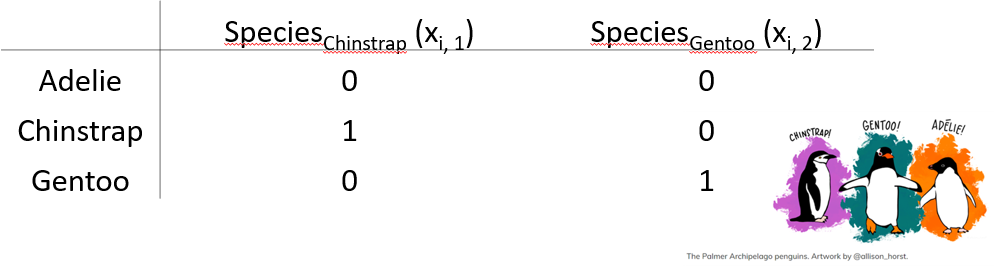

# Statistical Inference

## Learning Outcomes

+ Write `R` code to fit a linear regression model, and interpret estimated coefficients of these models:
    + a single categorical explanatory variable (using dummy variables)
    + no explanatory variable (a null model)
    + a single continuous explanatory variable
    + a continuous and a categorical factor explanatory variable
    + an interaction term in the explanatory variables
+ Explain why you may want to include interaction terms in a model.
+	Describe the differences between the operators `:` and `*` in an `R` model-fitting 	formula
+	Demonstrate how to make point predictions from linear regression models, specifically models with:
    + a single continuous explanatory variable
    + a continuous and a categorical factor explanatory variable
    + an interaction term in the explanatory variables
+	Understand how to undertake model selection using the `anova()` and `AIC()` functions in R and interpret the output
+	Compute confidence intervals in `R` to estimate a population parameter, and interpret their meaning


## Linear Regression


### Some mathematical notation

Let's consider a linear regression with a single explanatory variable. This is what the model looks like:

$$Y_i = \alpha + \beta_1x_i + \epsilon_i$$
where

$$\epsilon_i \sim \text{Normal}(0,\sigma^2).$$

Here for observation $i$

  + $Y_i$ is the value of the response 
  + $x_i$ is the value of the explanatory variable 
  + $\epsilon_i$ is the error term: the difference between $Y_i$ and its expected value
  + $\alpha$ is the intercept term (a parameter to be estimated), and 
  + $\beta_1$ is the slope: coefficient of the explanatory variable (a parameter to be estimated)
  
  Note: you may also see the intercept term $\alpha$ written as $\beta_0$

Does this remind you of anything?


### Modelling Bill Depth 

In the following statistical inference sections, we will be working with our `palmerpenguins` data set, where we are interested in examining a few different linear regression models with a different numbers of explanatory variables that may help us explain the variation in bill depth `bill_depth_mm`, our response variable. We will start with the simplest model, with no explanatory variables, and then add in more explanatory variables (both categorical and continuous) and alter the way they interact with each other in the model, while seeing how to use this sample data to draw inferences about the underlying population.


Let's take a look at the bill depth data in a histogram (it's always nice to have a visual!).

```{r, message = FALSE, warning=FALSE}
library(tidyverse)
library(palmerpenguins)
penguins_nafree <- penguins %>% drop_na()
```

```{r, message=FALSE}
ggplot(data = penguins_nafree, aes(x = bill_depth_mm)) +
  geom_histogram() + theme_classic() +
  xlab("Bill depth (mm)")

```


First off let's fit a null (intercept only, no slope)  model. This in *old money* would be called a one sample t-test. 

**Model formula**

The null model formula is: $$Y_i = \alpha + \epsilon_i.$$ 

Here for observation $i$, $Y_i$ is the value of the response (`bill_depth_mm`) and $\alpha$ is a parameter to be estimated (typically called the intercept).

The `R` code for this model specifies a `1` to represent a constant, as we have no explanatory variables in this model and there is no slope to estimate.
```{r null}
slm_null <- lm(bill_depth_mm ~ 1, data = penguins_nafree)
```

The hypotheses being tested are $H_0:\mu_{\text{bill_depth_mm}} = 0$ vs. $H_1:\mu_{\text{bill_depth_mm}} \neq 0$ 

``` {r}
summary(slm_null)$coef
```

**So, what are the values/regression coefficients from the `lm()` output above?**

+ `Estimate` of the `(Intercept)` = `r summary(slm_null)$coef[1,1]`, tells us the (estimated) average value of the response (in this example, it is the estimate of the population mean ($\mu$) of `bill_depth_mm`), which we can show using the code below:

```{r av}
penguins_nafree %>% summarise(average_bill_depth = mean(bill_depth_mm))
```

+ The SEM (`Std. Error`) = `r summary(slm_null)$coef[1,2]`. 

+ The t-statistic is given by `t value` = `Estimate` / `Std. Error` =  `r summary(slm_null)$coef[1,3]`

+ The *p*-value is given by`Pr (>|t|)` = 1.965076e-315

So the probability of observing a t-statistic as least as extreme given under the null hypothesis (average bill depth = 0) given our data is 1.965076e-315, pretty strong evidence against the null hypothesis I'd say! I hope this makes sense biologically as we would not expect the average bill depth of a penguin to be 0!
	

### Single continuous explanatory variable

**Does `bill_length_mm` help explain some of the variation in `bill_depth_mm`?**

**Model formula**

The formula for this model is $$Y_i = \alpha + \beta_1x_i + \epsilon_i$$ where for observation $i$ $Y_i$ is the value of the response (`bill_depth_mm`) and $x_i$ is the value of the explanatory variable (`bill_length_mm`); $\alpha$ and $\beta_1$ are population parameters to be estimated using our sample data. We could also write this model as
  


$$
\begin{aligned}
\operatorname{bill\_depth\_mm} &= \alpha + \beta_{1}(\operatorname{bill\_length\_mm}) + \epsilon
\end{aligned}
$$

**Fitted model**

We can output our estimated population parameters ($\alpha$ and $\beta_1$) using

```{r}
slm <- lm(bill_depth_mm ~ bill_length_mm, data = penguins_nafree)
summary(slm)$coef
```

The `Estimate` of the `(Intercept)` ($\alpha$ in the model) gives us the estimated average bill depth (mm) **given the estimated relationship** between bill length (mm) and bill depth (mm).

The `Estimate` of `bill_length_mm` ($\beta_1$ in the model) is the slope associated with bill length (mm). Here for every 1mm increase in bill length we estimated a `r -1*round(summary(slm)$coef[2,1],3)` mm decrease (or a `r round(summary(slm)$coef[2,1],3)` mm increase) in bill depth.

The plot below shows this relationship visually:

```{r}
## calculate predicted values
penguins_nafree$pred_vals <- predict(slm)
## plot
ggplot(data = penguins_nafree, aes(x = bill_length_mm, y = bill_depth_mm)) +
  geom_point() + ylab("Bill depth (mm)") +
  xlab("Bill length (mm)") + theme_classic() +
  geom_line(aes(y = pred_vals))

```

### A continuous and a categorical factor explanatory variable (Additive model)

**Does adding in `species` to the above model help explain more of the variation in `bill_depth_mm`?**\
Remember `species` is a categorical factor variable with three levels/groups: Adelie, Chinstrap and Gentoo.

```{r}
p2 <- ggplot(data = penguins_nafree,
             aes(y = bill_depth_mm, x = bill_length_mm, color = species)) +
  geom_point() + ylab("Bill depth (mm)") +
  xlab("Bill length (mm)") + theme_classic()
p2
```

```{r}
# notice the + between the two explanatory variables?
# this + is what indicates this is an additive model
slm_sp <- lm(bill_depth_mm ~ bill_length_mm + species, data = penguins_nafree)
```


**Model formula**

Now we have **two explanatory variables**, if they were both continuous variables, the model formula would be...

$$Y_i = \beta_0 + \beta_1z_i + \beta_2x_i + \epsilon_i$$
$$\epsilon_i \sim \text{Normal}(0,\sigma^2)$$

where for observation $i$

  + $Y_i$ is the value of the response (`bill_depth_mm`)
  + $z_i$ is one explanatory variable (`bill_length_mm` say)
  + $x_i$ is another explanatory variable (`species` say)
  + $\epsilon_i$ is the error term: the difference between $Y_i$ and its expected value
  + $\alpha$, $\beta_1$, and $\beta_2$ are all parameters to be estimated.
  
...but because one of the variables is **categorical**, our model formula needs to be written in a slightly more complicated way

$$Y_i = \beta_0 + \beta_1z_i + \beta_2x_{i,1} + \beta_3x_{i,2} + ... +\beta_kx_{i,k}+ \epsilon_i$$
where the only new terminology from the above formula is 

  + $x_{i,k}$ is the value of the explanatory variable (where *k* = # of levels of the variable - 1, as one level is the intercept)

Another way to write this model formula for this example is


$$
\begin{aligned}
\operatorname{bill\_depth\_mm} &= \alpha + \beta_{1}(\operatorname{bill\_length\_mm}) + \beta_{2}(\operatorname{species}_{\operatorname{Chinstrap}}) + \beta_{3}(\operatorname{species}_{\operatorname{Gentoo}})\ + \\
&\quad \epsilon
\end{aligned}
$$


When we have categorical explanatory variables (e.g., `species`) we have to use **dummy variables** to estimate population parameters in our linear regression model.

*What is a dummy variable?*\
It is a variable created to assign numerical value to levels of categorical variables. This is necessary with most categorical variables because an individual usually cannot be in more than one group/level (e.g., a Chinstrap penguin cannot be a Gentoo penguin too!). So the dummy variable coding works by representing one category of the explanatory variable and is coded with 1 if the case falls in that category and with 0 if not.

Here's an example dummy variable table for `species` in the `palmerpenguin` data set:



Here the `Adelie` group is the baseline (`R` does this alphabetically by default. To change this, we can use the `mutate` function. See section 5.2.4.2 in Hypothesis testing for more details) so we assign a 0 to `speciesChinstrap` and a 0 to `speciesGentoo` to see what the response is for Adelie penguins `(Intercept)`. This is shown in the top line row of the table above. 

**Fitted model**

```{r}
summary(slm_sp)$coef
```

Here, the `Estimate` of the `(Intercept)` ($\alpha$ or $\beta_0$ in the model) gives us the estimated average bill depth (mm) of the **Adelie** penguins **given the other variables in the model**.

The `Estimate` of `bill_length_mm` ($\beta_1$ in the model) is the slope associated with bill length (mm). So, here for every 1 mm increase in bill length we estimated a `r round(summary(slm_sp)$coef[2,1],3)` mm increase in bill depth.

What about the regression coefficients of the other species levels (`Estimate` for `speciesChinstrap` and `speciesGentoo`)? These values give the shift (up or down) of the **parallel** lines from the **Adelie** (`(Intercept)`) level. So given the estimated relationship between bill depth and bill length these coefficients are the estimated change for each species from the baseline. You can visualise this by looking at the plot below.

```{r}
## calculate predicted values
penguins_nafree$pred_vals <- predict(slm_sp)
## plot
ggplot(data = penguins_nafree, aes(y = bill_depth_mm, x = bill_length_mm, color = species)) +
  geom_point() + ylab("Bill depth (mm)") +
  xlab("Bill length (mm)") + theme_classic()  +
  geom_line(aes(y = pred_vals))

```

**Simpson's paradox...** look how the slope associated with bill length (coefficient of `bill_length_mm`) has switched direction from the model with just one explanatory variable `bill_length_mm`! Why do you think this is?


### A continuous and a categorical factor explanatory variable (Interaction model)

Recall the *additive* model formula from above

$$Y_i = \beta_0 + \beta_1z_i + \beta_2x_i + \epsilon_i$$
An additive model will always produce regression lines that are **parallel** with each other (i.e., there is no relationship between the explanatory variables, they act independently of each other)...

**...but**  we should really check to see if the explanatory variables have relationships with each other (i.e., the explanatory variables do not act independently on the response variable.). If this is the case, the regression lines will **not be parallel** with each other.

**Model formula**

This is still for two explanatory variables

$$Y_i = \beta_0 + \beta_1z_i + \beta_2x_{i,1} + \beta_3x_{i,2} + ... +\beta_kx_{i,k}+ \beta_4z_ix_{i,k} + \epsilon_i$$
You'll notice a new term $\beta_4z_ix_{i,k}$ in this model compared to the additive model. This is the **interaction term** between the two explanatory variables $z_i$ and $x_{i,k}$.

The model formula for our penguin example can also be written as 


$$
\begin{aligned}
\operatorname{bill\_depth\_mm} &= \alpha + \beta_{1}(\operatorname{bill\_length\_mm}) + \beta_{2}(\operatorname{species}_{\operatorname{Chinstrap}}) + \beta_{3}(\operatorname{species}_{\operatorname{Gentoo}})\ + \\
&\quad \beta_{4}(\operatorname{bill\_length\_mm} \times \operatorname{species}_{\operatorname{Chinstrap}}) + \beta_{5}(\operatorname{bill\_length\_mm} \times \operatorname{species}_{\operatorname{Gentoo}}) + \epsilon
\end{aligned}
$$

where $\beta_4$bill_length_mm x species~Chinstrap~ and $\beta_5$bill_length_mm x species~Gentoo~ represent the interaction terms in the model.

*This is getting pretty complicated already and we only have two explanatory variables!!!*

*However, we can add in more explanatory variables, both categorical and/or continuous, with additive and/or interaction terms between variables and the same principles for inference apply. We will practice with slightly more complicated data in our lab assignment this week.*

**Note:** we can include interaction effects in our `lm()` model in `R` by using either the `*` or `:` syntax in our model formula. For example,

 + `:` denotes the interaction only of the variables to its left and right, and

 + `*` means to include all main effects and interactions, so `a * b` is the same as `a + b + a:b`, where `a` and `b` represent the main effects and `a:b` represents the interaction term in the model.

To specify a model with additive and interaction effects use either

```{r}
slm_int <- lm(bill_depth_mm ~ bill_length_mm * species, data = penguins_nafree)

```

Or the other way we could write this and get the SAME MODEL is

```{r}
slm_int <- lm(bill_depth_mm ~ bill_length_mm + species + 
                bill_length_mm : species, data = penguins_nafree)

```

**Fitted model**

```{r}
summary(slm_int)$coef
```

As before, the `Estimate` of the `(Intercept)` gives us the estimated average bill depth (mm) of the **Adelie** penguins **given the other variables in the model**.

The `bill_length_mm` : `Estimate` ($\beta_1$ in the model) is the slope associated with bill length (mm). So, here for every 1 mm increase in bill length we estimated a `r round(summary(slm_int)$coef[2,1],3)` mm increase in bill depth.

The main effects of species (i.e., `Estimate` for `speciesChinstrap` and `speciesGentoo`) again give the shift (up or down) of the lines from the **Adelie** level; however these lines are no longer parallel! The interaction terms (i.e., `bill_length_mm:speciesChinstrap` and `bill_length_mm:speciesGentoo`) specify the species specific slopes **given the other variables in the model**.

```{r}
## calculate predicted values
penguins_nafree$pred_vals <- predict(slm_int)
## plot
ggplot(data = penguins_nafree, aes(y = bill_depth_mm, x = bill_length_mm, color = species)) +
  geom_point() + ylab("Bill depth (mm)") +
  xlab("Bill length (mm)") + theme_classic()  +
  geom_line(aes(y = pred_vals))

```

Look at the plot above. Now we've specified this *all singing and dancing* interaction model we might ask **are the non-parallel lines non-parallel enough to say this model is better than the parallel line model**?

## Model comparison, selection, and checking (again)

Remember that it is always is imperative that we **check the underlying assumptions** of our model! If our assumptions are not met then basically the maths falls over and we can't reliably interpret the outputs from the model (e.g., can't trust the parameter estimates etc.). 

**Key assumptions of linear regression models**

+ **Independence** 
+ There is a **linear relationship** between the response and the explanatory variables
+ The residuals have **constant variance**
+ The residuals are **normally distributed**
  
Let's look at the fit of the `slm` model (single continuous explanatory variable)

```{r}
gglm::gglm(slm) # Plot the four main diagnostic plots
```

Do you think the model assumptions have been met? Think of what this model is, do you think it's the best we can do? 

### Model comparison and selection

A good model not only needs to fit data well, it also needs to be parsimonious. That is, a good model should be only be as complex as necessary to describe a data set. If you are choosing between a very simple model with 1 explanatory variable, and a very complex model with, say, 10 explanatory variables, the very complex model needs to provide a much better fit to the data in order to justify its increased complexity. If it can’t, then the simpler model should be preferred. After all, it's also much easier to interpret a simpler model (look at our increased complexity from just adding the interaction term in a two explanatory variable model)!

#### Model comparison using `anova()`

We can compare **nested** linear models using hypothesis testing. Luckily the `R` function `anova()` automates this if you input the two regression objects as separate arguments. Yes, it's the same idea as we've previously learnt about ANOVA. We perform an F-test between the nested models! 

By **nested** we mean that one model is a subset of the other (i.e., where the coefficients both models have in common cancel each other out, so they are essentially weighted at zero). For example,

$$Y_i = \beta_0 + \beta_1z_i + \epsilon_i$$

is a nested version of

$$Y_i = \beta_0 + \beta_1z_i + \beta_2x_i + \epsilon_i$$ 
This ANOVA will test whether or not including $\beta_2x_i$ leads to a significant improvement in the model.

As an example consider testing the single explanatory variable model `slm` against the same model with `species` included as a variable  `slm_sp`. To carry out the appropriate hypothesis test in `R` we can run

```{r, echo = TRUE}
anova(slm,slm_sp)
```

As you'll see the `anova()` function takes two model objects (`slm` and `slm_sp`) each as arguments. It returns an ANOVA testing whether the simpler model (`slm`) is just as good at capturing the variation in the data as the more complex model (`slm_sp`). The returned p-value should be interpreted as in any other hypothesis test. i.e., the probability of observing a statistic as least as extreme under our null hypothesis (here, that either model is as good as each other at capturing the variation in the data, or model 1 = model 2, or model 1 - model 2 = 0).

What would we conclude here from the output above comparing `slm` and `slm_sp`? We can see the results show a `Df` of `2` (indicating that the more complex model has two additional parameters) and a very small p-value (<2e-16). I'd say we have very strong evidence against the models being equally good, and adding `species` to the model lead to a significantly improved fit over `slm` without `species`! Looking at the relevant plots, does this make sense?

Now what about `slm_int` vs `slm_sp`?
**Are the non-parallel lines non-parallel enough to say the more complicated interaction model is better than the simpler parallel line additive model?** 

```{r, echo = TRUE}
anova(slm_sp,slm_int)
```

So it seems both models are just as good at capturing the variation in our data: we're happy with the simpler model with parallel lines! 

#### Model comparison using `AIC()`

Another way we might compare models is by using the Akaike information criterion (AIC) (you'll see more of this later in the course). AIC is an estimator of out-of-sample prediction error and can be used as a metric to choose between competing models. Lower AIC scores are better, and AIC penalizes models that use more parameters. So if two models explain the same amount of variation, the one with fewer parameters (`df`) will have a lower AIC value (i.e., smallest out-of-sample prediction error) and will be the better-fit model. Typically, a difference of 4 or more is considered to indicate an improvement; this should not be taken as writ however, using multiple comparison techniques is advised.

`R` has an `AIC()` function that can be used directly on your `lm()` model objects. The `AIC()` function can take multiple arguments compared to `anova()` that can only compare two models at a time. For example,

```{r, echo = TRUE}
AIC(slm_null, slm, slm_sp, slm_int)
```

This supports what the `anova()` output suggested; `slm_sp` is the preferred model. As always it's important to do a sanity check! Does this make sense? Have a look at the outputs from these models and see what you think.

Just because we've chosen a model (*the best of a bad bunch* perhaps?) this doesn't let us off the hook. We should check our assumptions...

...well, we should have checked them before we started to interpret the data!

```{r}
gglm::gglm(slm_sp) # Plot the four main diagnostic plots
```

**Residuals vs Fitted** plot: equal spread? Doesn't look too trumpety/slice of pizza shaped! Don't worry that there aren't many points between 16-17 on the x-axis.

**Normal quantile-quantile (QQ)** plot: skewed? Maybe slightly right skewed (deviation upwards from the right tail) but probably nothing to worry about.

**Scale-Location** plot: equal spread and relatively straight line? I'd say so.

**Residuals vs Leverage**: ? Maybe a couple of points with high leverage.

## Confidence intervals and point predictions

So far, we've got population parameter estimates from our linear regression models (all the $\alpha$s and $\beta$s!). We've used other statistical tools to check the linear regression model assumptions are met and also selected the best model (in terms of which explanatory variables are most useful, and whether they should be treated as independent from each other (additive) or interacting).
However, there's a couple more things we might like to do, such as:

+ determine confidence intervals for parameter estimates
+ make point predictions (i.e., input explanatory variable information to predict the response variable)

### Confidence intervals

Confidence intervals provide a range of values around a population estimate that are believed to contain, with a certain probability (e.g., 95%), the true value of that estimate. They provide a way to quantify the uncertainty about the value of that population estimate we have calculated from the sample data.

For the *chosen* `slm_sp` model we can get the confidence intervals for the regression coefficient estimates in `R` by using the `confint()` function. 

```{r, echo = TRUE}
cis <- confint(slm_sp)
cis
# By default the 95% confidence intervals are returned 
# you can change this using the `level = ` argument
```

+ This tells us that for every 1 mm increase in bill length we are 95% confident the expected bill depth will increase between `r round(cis[2,1],3)` and `r round(cis[2,2],3)` mm (3 sf).

+ We are 95% confident that the average bill depth of a Chinstrap penguin is between
`r -1*round(cis[3,2],1)` and `r -1*round(cis[3,1],1)` mm shallower than the Adelie penguin.

To interpret these correctly we must understand what they are telling us. That is, **95% of the time, our 95% confidence intervals taken from a random sample will contain the true population parameter we are wanting to estimate.**

[Check out this cool visualisation of CI's](https://rpsychologist.com/d3/ci/ "Interpreting Confidence intervals")

### Point prediction

Using the `slm_sp` model we can make a point prediction for the expected bill depth (mm) for Gentoo penguins with a bill length of 50mm.

Recall the model equation


$$
\begin{aligned}
\operatorname{bill\_depth\_mm} &= \alpha + \beta_{1}(\operatorname{bill\_length\_mm}) + \beta_{2}(\operatorname{species}_{\operatorname{Chinstrap}}) + \beta_{3}(\operatorname{species}_{\operatorname{Gentoo}})\ + \\
&\quad \epsilon
\end{aligned}
$$

And recall the output table from this model, with estimates.

```{r}
summary(slm_sp)$coef
```

We can then substitute in the values (using our dummy variable coding for `species`):

$$
\begin{aligned}
\widehat{\text{bill depth}} & = \hat{\alpha} + \hat{\beta_1}*50 + \hat{\beta_2}*0 + \hat{\beta_3}*1\\
\ & = 10.56 + 0.20*50 - 1.93*0- 5.10*1\\
\ & = 10.56 + 10 - 5.10\\
\ & = 15.46\text{mm}
\end{aligned}
$$

Rather than *by hand* we can do this easily in `R`

```{r,echo = TRUE}
## create new data frame with data we want to predict
## the names have to match those in our original data frame
newdf <- data.frame(species = "Gentoo", bill_length_mm = 50)
## use predict() function
predict(slm_sp, newdata = newdf) ## more accurate than our by hand version!
```
What does this look like on a plot

```{r, echo = FALSE}
## calculate predicted values
penguins_nafree$pred_vals <- predict(slm_sp)
pred_data <- data.frame(x = c(30,50), y = c(predict(slm_sp, newdata = newdf),10))
ggplot(data = penguins_nafree, aes(y = bill_depth_mm, x = bill_length_mm, color = species)) +
  geom_point() + ylab("Bill depth (mm)") +
  xlab("Bill length (mm)") + theme_classic()  +
  geom_line(aes(y = pred_vals)) + 
  geom_segment(data = pred_data, aes(x = x[1], y = y[1], xend = x[2], yend = y[1]), 
               inherit.aes = FALSE) + 
  geom_segment(data = pred_data, aes(x = x[2], y = y[1], xend = x[2], yend = y[2]), 
               inherit.aes = FALSE) +
  coord_cartesian(xlim = ggplot_build(p2)$layout$panel_scales_x[[1]]$range$range,
                  ylim = ggplot_build(p2)$layout$panel_scales_y[[1]]$range$range)
```

## TL;DR `lm()`


| Traditional name    | Model formula  | R code  |
| ------------------- |:--------------:| -------:|
| Simple regression   | $Y \sim X_{continuous}$ | `lm(Y ~ X)` |
| One-way ANOVA       | $Y \sim X_{categorical}$      |   `lm(Y ~ X)` |
| Two-way ANOVA       | $Y \sim X1_{categorical} + X2_{categorical}$| `lm(Y ~ X1 + X2)` |
| ANCOVA              | $Y \sim X1_{continuous} + X2_{categorical}$ |`lm(Y ~ X1 + X2)` |
| Multiple regression | $Y \sim X1_{continuous} + X2_{continuous}$ | `lm(Y ~ X1 + X2)` |
| Factorial ANOVA     | $Y \sim X1_{categorical} * X2_{categorical}$|   `lm(Y ~ X1 * X2)` or `lm(Y ~ X1 + X2 + X1:X2)` |

**[Artwork by \@allison_horst](https://github.com/allisonhorst/stats-illustrations)**


### **Model formula** syntax

In `R` to specify the model you want to fit you typically create a model formula object; this is usually then passed as the first argument to the model fitting function (e.g., `lm()`).

Some notes on syntax:

Consider the model formula example `y ~ x + z + x:z`. There is a lot going on here:

 + The variable to the left of `~` specifies the response, everything to the right specify the explanatory variables
 + `+` indicates to include the variable to the left and right of it (it does **not** mean they should be summed)
 + `:` denotes the interaction of the variables to its left and right
 
Additionally, some other symbols have special meanings in model formula:

 + `*` means to include all main effects and interactions, so `a * b` is the same as `a + b + a:b`
 
 + `^` is used to include main effects and interactions up to a specified level. For example, `(a + b + c)^2` is equivalent to `a + b + c + a:b + a:c + b:c` (note `(a + b + c)^3` would also add `a:b:c`)
 + `-` excludes terms that might otherwise be included. For example, `-1` excludes the intercept otherwise included by default, and `a*b - b` would produce `a + a:b`
 
Mathematical functions can also be directly used in the model formula to transform a variable directly (e.g., `y ~ exp(x) + log(z) + x:z`). One thing that may seem counter intuitive is in creating polynomial expressions (e.g., $x^2$). Here the expression `y ~ x^2` does **not** relate to squaring the explanatory variable $x$ (this is to do with the syntax `^` you see above. To include $x^2$ as a term in our model we have to use the `I()` (the "as-is" operator). For example, `y ~ I(x^2) `).

## Other resources: optional but recommended

+ [Exploring interactions with continuous predictors in regression models](https://interactions.jacob-long.com/articles/interactions.html)
+ [The ASA Statement on p-Values: Context, Process, and Purpose](https://www.tandfonline.com/doi/full/10.1080/00031305.2016.1154108)


## Beyond Linear Models to Generalised Linear Models (GLMs) (*not examinable*)

Recall the assumptions of a linear model

+ The $i$th observation's response, $Y_i$, comes from a normal distribution
+ Its mean, $\mu_i$, is a linear combination of the explanatory terms
+ Its variance, $\sigma^2$, is the same for all observations
+ Each observation's response is independent of all others
  
But, what if we want to rid ourselves from a model with normal errors? 

The answer: Generalised Linear Models.

### Counting animals... 

A normal distribution does not adequately describe the response, the number of animals

 + It is a continuous distribution, but the response is discrete
 + It is symmetric, but the response is unlikely to be so
 + It is unbounded, and assumes it is plausible for the response to be negative


In addition, a linear regression model typically assumes constant variance, but in this situation this unlikely to be the case.

So why assume a normal distribution? Let's use a Poisson distribution instead.

\begin{equation*}    
    \mu_i = \beta_0 + \beta_1 x_i,
  \end{equation*}

So 
  \begin{equation*}
    Y_i \sim \text{Normal}(\mu_i\, \sigma^2),
  \end{equation*}
  
becomes
  
\begin{equation*}
    Y_i \sim \text{Poisson}(\mu_i),
\end{equation*}
  
The Poisson distribution is commonly used as a general-purpose distribution for counts. A key feature of this distribution is $\text{Var}(Y_i) = \mu_i$, so we expect the variance to increase with the mean.

### Other modelling approaches (not examinable)

| `R` function    | Use                    | 
| --------------- |------------------------|
| `glm()`         | Fit a  linear model with a specific error structure specified using the `family =` argument (Poisson, binomial, gamma)|
| `gam()`         | Fit a generalised additive model. The R package `mgcv` must be loaded |
|`lme()` and `nlme()`| Fit linear and non-linear mixed effects models. The R package `nlme` must be loaded |
| `lmer()`        | Fit linear and generalised linear and non-linear mixed effects models. The package `lme4` must be installed and loaded |
| `gls()`         | Fit generalised least squares models. The R package `nlme` must be loaded |

