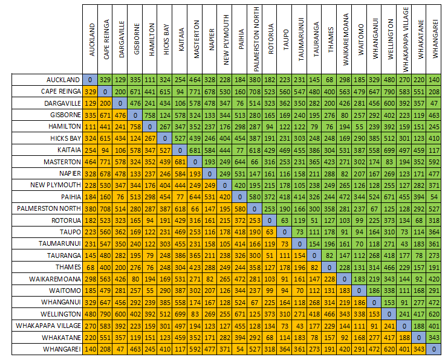
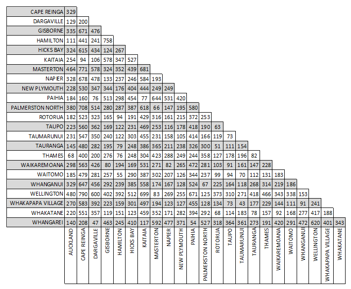
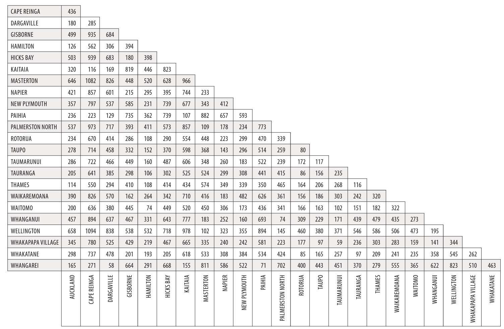
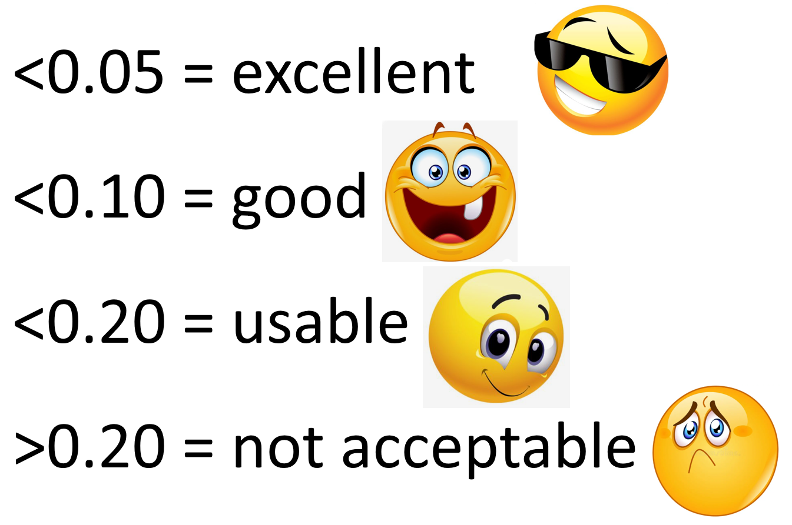

---
output:
  html_document: default
  pdf_document: default
---
# Multivariate Data Analysis

```{r, setup, include=FALSE}
knitr::opts_chunk$set(
  message = FALSE, warning = FALSE
)
```

<div class="alert alert-success" role="alert">
<center>{width=10%}</center>

<strong>Learning outcomes</strong>

<ul>
<li> Define multivariate data </li>
<li> Describe what dimension reduction is and why we apply it </li>
<li> Explain the aims, steps and uses of non-metric multidimensional scaling (nMDS) for biological application </li>
<li> Compare two different distance measures, namely Euclidean and Bray Curtis, and know when it is appropriate to use each one </li>
<li> Write `R` code to carry out nMDS, plot a 2-D solution and perform associated diagnostic plots </li>
<li> Interpret and effectively communicate nMDS outputs </li>

</ul>
</div>


## What is multivariate data?

So far in this course we have visualised and analysed data with, at most a few variables, where each variable generally requires a dimension in space or a separate axis on a graph to be visualised (e.g., if we have 8 variables in a data set, we would require 8 dimensions/an 8-axis graph to show them all). We are pretty good at looking for patterns in data in 1- and 2-dimensions (2-D), we're ok with 3-D, but for most people the thought of visualising what 4-D or above even looks like is mind-boggling enough without even thinking about interpreting data in these high dimensions!! Unfortunately, most biological data sets contain many variables (aka is high-dimensional or multivariate), so we can do one of two things:

+ Analyse the data in pairs of variables, which can kind of work for smallish multivariate data sets however, this quickly gets challenging to make overall interpretations of the data set as a whole. 
+ Use statistical tools to search for patterns in the data in multivariate space and summarise those patterns into a lower dimensionality so our brains can process it!! 

Let's elaborate more on the second option presented here...
 
## Dimension reduction

When data is high-dimensional, it is hard to distinguish between the important variables that are relevant to the output and the redundant or not-so important ones. **Dimension reduction** can make the data less noisy while retaining the important information and simplify it for exploration, interpretation, and visualisation.

The main aim of **dimension reduction** is to find the best low-dimensional representation of the variation in a multivariate data set, but how do we do this? There are many methods that all have slightly different uses, including principal component analysis (PCA), principal coordinate analysis (PCO), cluster analysis, discriminant analysis etc.  – and one that is commonly used in many areas of biology that we are going to explore in more detail is non-metric multidimensional scaling (nMDS). 

### Non-metric multidimensional scaling (nMDS)

The aim of nMDS is to ‘map’ the original position of samples in a dataset in multidimensional space as accurately as possible using a reduced number of dimensions. This means the distances between the sample points in the specified reduced dimensions (usually 2-D because this is easiest for our brains to visualise, but sometimes 3-D if required) is as closely matched as possible to the relative distances among the samples from the original higher dimension dataset. For example, if sample A has higher similarity to sample B than it does to sample C then sample A will be placed closer on the map to sample B than it is to sample C. This makes it easier for the original data to be plotted, visualized and interpreted.

## Distance matrices and measures

To create a nMDS visualisation, the original data must first be translated into a distance matrix, as shown in the diagram below. 


R will automatically calculate the distance matrix for us using the original data when we write code to produce an nMDS plot, but it’s important we know what a distance matrix is and how it is calculated. The reason is we need to input the type of distance matrix we want `R` to use, which differs depending on your data.

An example of a distance matrix you may have seen before is distances between cities on a map. Below is a distance matrix for flight distances (in kilometres) between locations in the North Island of New Zealand. 



Since distance is symmetric (i.e. distance between A and B is equal to distance between B and A), we can focus on only the lower (orange) or upper (green) triangular part of the matrix. The diagonal elements of a distance matrix (blue) are zero because they represent the distance of a sample from itself. So this information is often shown in a triangular matrix, as below.



Another way we could measure the distance between these cities would be to use driving distances. These distances differ from flight distances as the roads are not usually in a straight line to a location; instead they go around mountains, through valleys and connect towns and cities together. Below is a distance matrix for driving distances (in kilometres) between locations in the North Island of New Zealand. You should note that all the flight distances are shorter than the driving distances. 


[Link to source](https://www.destination-nz.com/new-zealand-information/essentials/distance-charts)

We could also display distance matrices of flight times, driving times etc. There are many ways to calculate distance between these geographic locations! In a similar way, there are also many distance measures we can use to determine differences between biological samples [See Legendre & Legendre’s 1998 (& 2012) book Numerical Ecology](https://www.library.auckland.ac.nz/search/numerical%20ecology%20legendre). We will introduce two commonly used distance measures in biology – Euclidean distance and Bray-Curtis distance.

### Euclidean distance

**Drawing a straight line between A and B** is also termed “as the crow flies” distance. This is how the flight distances in the example above were measured and is also called **Euclidean distance - a very commonly used distance measure**. It is the way we measure most things in life! 


Above we have two points *A* and *B* (these could be biological samples or observations) and we want to know the straight line, as the crow flies, distance between them so we can use the Euclidean distance formula to calculate this.

(Note: if you remember a bit of high school mathematics, you may notice this is Pythagoras’ formula).

Let’s say x~1~ = 1, x~2~ = 5, y~1~ = 1 and y~2~ = 3. We could write this as A (1, 1) and B (5, 3).

$$
\begin{aligned}
  d_{Euclidean}(A, B) & = \sqrt{(x_2 - x_1)^2 + (y_2 - y_1)^2}\\
  & = \sqrt{(5 - 1)^2 + (3 - 1)^2}\\
  & = \sqrt{(4)^2 + (2)^2}\\
  & = \sqrt{16 + 4}\\
  & = \sqrt{20}\\
  & = 4.47
\end{aligned}
$$

This example only has two variables (x and y) so only two dimensions, however, we can use this formula to calculate distance between two points (or samples with biological data) for any number of variables in multivariate space (or R can do it for us!). A more generic way to write the formula for multivariate data is:

$$d_{Euclidean}(j, k) = \sqrt{\sum^{n} (y_{i,j} - y_{i,k})^2}$$
where *j* and *k* represent the two samples whose distance is being measured, so $y_{i,j}$ is the value of variable *i* in sample *j*, and $y_{i,k}$ is the value of variable *i* in sample *k*, and *n* is the total number of samples. "the value of the variable *i* in sample *j*" would be equivalent to the abundance of a particular species *i* in a location/sample *j*.

Below is a made-up ecological data set with four samples (S1 - S4, let’s say they are different locations) and seven variables (V1 - V7, let’s say they are different species).

```{r echo=FALSE}
tab <- as.table(rbind(c(0,5,3,0,2,0,0), c(0,10,6,0,4,0,0), 
                      c(1,0,0,1,0,1,0), c(0,1,1,0,1,0,0))) 
dimnames(tab) <- list(Sample = c("S1","S2","S3","S4"), 
                      Variable  = c("V1", "V2", "V3", "V4", "V5", "V6", "V7")) 
tab
```

Take a minute to study this data.

+ which samples/locations do you think are most similar to each other?
+ which samples/locations are most different from each other?

`R` will calculate the distance matrix for us, but let’s practice calculating the Euclidean distance between sample 1 & 2. (doing these calculations is not examinable)

$$
\begin{aligned}
  d_{Euclidean}(j, k) & = \sqrt{\sum^{n} (y_{i,j} - y_{i,k})^2}\\
  d_{Euclidean}(1, 2) & = \sqrt{\sum(y_{(V1,S1)} - y_{(V1,S2})^2 + (y_{(V2,S1)} - y_{(V2,S2)})^2 + ... +(y_{(V7,S1)} - y_{(V7,S2)})^2}\\
  & = \sqrt{(0 - 0)^2 + (5 - 10)^2 + (3 - 6)^2 + (0 - 0)^2 + (2 - 4)^2 + (0 - 0)^2 + (0 - 0)^2}\\
  & = \sqrt{(-5)^2 + (-3)^2 + (-2)^2}\\
  & = \sqrt{38}\\
  & = 6.1644
\end{aligned}
$$

This means the distance between samples 1 and 2 in 7-D space is 6.1644.

The complete triangular distance matrix using the Euclidean distance measure is:

```{r echo=FALSE}
dm_euc <- as.table(matrix(c(NA, NA, NA, NA, 6.1644, NA, NA, NA, 6.4031, 12.45, NA, NA, 4.5826, 10.724, 2.4495, NA), nrow=4, byrow=TRUE,
                          dimnames=list(c(1,2,3,4),c(1,2,3,4))))
dm_euc
```

Now take a minute to study the values in the distance matrix above. Larger values mean they are further apart/less similar to each other. Is this the same as what you expected to see when looking at the original data set?

Samples 2 & 4 appear very different from each other with a distance of 10.724, but they share all the same species. Samples 3 & 4 appear the most similar to each other with a distance of 2.4495, even though they have no species in common. What’s going on here?


**Euclidean distance...**

+ ...is a really useful distance measure for “well-behaved” data (without many zeroes or the zeroes are meaningful) and approximately normally distributed data!!
+ ...does not have an upper value boundary (can be any number larger than zero).
+	...separates samples more when they contain variables with large ranges (large differences in abundance values) e.g., samples 2 & 4.
+	...between two samples not sharing any variable/species may be smaller than between two samples sharing all variables/species, but with the same variables/species having large abundance differences between samples e.g., samples 3 & 4 vs samples 2 & 4, respectively. In other words, the distance between 0 and 1 is treated the same as the distance between 1 and 2, or 1001 and 1002. In this example, there is a difference of 1 between each pair of numbers (0 & 1, 1 & 2, 1001 & 1002) and that is how similarity is measured; it does not matter if these are low or high values.
+	...will put samples with low counts closer together, even when they have no variables/species in common i.e., samples 3 & 4.
+	...is a symmetrical index, i.e., it treats double zeros in the same way as double presences. This means it is not appropriate for data sets where joint absences are considered meaningless, i.e., if two samples do not have a particular variable/species present, does this mean they are more similar to each other?

### Bray-Curtis (BC) distance

The Bray-Curtis dissimilarity measure is commonly used for many types of biological data (e.g., community composition data, metagenomics, medicine). It takes the sum of the absolute differences between samples (that's what the |...| symbols mean) and divides by the total sum for a pair of samples. By doing this, it calculates the proportion of mis-matching individuals between samples. The formula is:

$$d_{Bray-Curtis}(j,k) = \sum^n \frac{|y_{i,k} - y_{j,k}|}{(y_{i,k} + y_{j,k})}$$ 

where *j* and *k* represent the two samples whose distance is being measured, so $y_{i,j}$ is the value of variable *i* in sample *j*, and $y_{i,k}$ is the value of variable *i* in sample *k*, and *n* is the total number of samples. "the value of the variable *i* in sample *j*" would be equivalent to the abundance of a particular species *i* in a location/sample *j* for community structure data. The result will always take a value between 0 and 1, where **0 = the samples are identical to each other and 1 = the samples have no variables in common**.\
(Note: this is often converted to a Bray-Curtis **similarity** distance by BC~sim~ = 1 - BC~dissim~. Why? Because it is more intuitive to interpret 0 = nothing in common and 1 = identical! You need to be aware of whether the **dissimilarity** or the **similarity** distance measure is being used, as it can drastically impact your interpretation!!)

Let’s use the same made-up data set we used before to calculate a Bray-Curtis dissimilarity distance matrix:

```{r echo=FALSE}
tab <- as.table(rbind(c(0,5,3,0,2,0,0), c(0,10,6,0,4,0,0), 
                      c(1,0,0,1,0,1,0), c(0,1,1,0,1,0,0))) 
dimnames(tab) <- list(Sample = c("S1","S2","S3","S4"), 
                      Variable  = c("V1", "V2", "V3", "V4", "V5", "V6", "V7")) 
tab
```

As mentioned earlier, `R` will calculate the distance matrix for us, but let’s practice calculating the Bray-Curtis distance between sample 1 & 2. (doing these calculations is not examinable)

$$
\begin{aligned}
d_{Bray-Curtis}(j,k)& = \sum^n \frac{|y_{i,k} - y_{j,k}|}{(y_{i,k} + y_{j,k})}\\
d_{Bray-Curtis}(1,2)& = \frac{|(y_{(V1,S1)} - y_{(V1,S2}) + (y_{(V2,S1)} - y_{(V2,S2)}) + ... +(y_{(V7,S1)} - y_{(V7,S2)})|}
{(y_{(V1,S1)} + y_{(V1,S2}) + (y_{(V2,S1)} + y_{(V2,S2)}) + ... +(y_{(V7,S1)} + y_{(V7,S2)})}\\
& = \frac{|0-0| + |5-10| + |3-6| + |0-0| + |2-4| + |0-0| + |0-0|}{(0+0) + (5+10) + (3+6) + (0+0) + (2+4) + (0+0) + (0+0)}\\
& = \frac{5 + 3 + 2}{15 + 9 + 6}\\
& = \frac{10}{30}\\
& = 0.333
\end{aligned}
$$
(out of a total of 30 individuals in samples 1 and 2, 10 cannot be paired with an individual of the same species/variable from the other location/sample)

The complete triangular distance matrix using the Bray-Curtis dissimilarity distance measure is:

```{r echo=FALSE}
dm_bc <- as.table(matrix(c(NA, NA, NA, NA, 0.333, NA, NA, NA, 1, 1, NA, NA, 0.538, 0.739, 1, NA), nrow=4, byrow=TRUE,
                          dimnames=list(c(1,2,3,4),c(1,2,3,4))))
dm_bc
```

You will see that this differs significantly from the Euclidean distance matrix. Samples 1 & 2 appear the most similar to each other and sample 3 differs completely from the other three samples. This may be more like what you expected to see when you first looked at this data set. *This illustrates why it is important to choose the right distance measure specific to your data set* :-)

**Bray-Curtis dissimilarity distance...**

+ ...reflects changes in composition and relative abundances pretty well. 
+ ...adds more weighting to relatively rare individuals, as differences between smaller values matter. This is because it is calculated as a fraction. Let's consider two hypothetical samples to expand on this... If we had a sample with two variables/species that had abundances of 1001 and 1002, the difference between the two values is 1, but in proportion to the total abundance (2003) it is very small. On the other hand, if we had another sample with abundances of 1 and 2, the difference between the two values is still 1, but the total abundance is 3 so it is a comparably large proportion. Because the latter is a larger fraction (closer to 1) this one is considered more different/adds more weighting.
+ ...always treats joint absences as unimportant – they do not make the samples more similar to each other.

## Why is nMDS used frequently in biology?

+ It makes few (if any) model assumptions about the form of the data.
+ As the name suggests, it is a non-parametric (“non-metric”) technique. This means that data is not required to fit a normal distribution - an assumption of parametric tests, like linear regression we looked at earlier in the course. Fulfilling the multivariate normality assumptions can be very challenging in many biological data sets.
+ What makes nMDS non-metric is that it is rank-based. This means that instead of using the actual values to calculate distances between samples, it uses ranks. For example, instead of saying that sample A is 5 points away from sample B, and 10 from sample C, you would instead say that: sample A is the “1st” most close sample to B, and sample C is the “2nd” most close. These ranks of the similarities between samples are the only information used by nMDS. NOTE: metric MDS (mMDS) would use the actual distances between samples generated in the distance matrix and if the data fit this model, it is the preferred method although we will not be covering this in this course. If we use the Euclidean and the Bray-Curtis distance matrices calculated above, we can display these as the rank-based information that is used to create an nMDS plot.

Euclidean distance matrix (left) and resultant rank-based matrix used to create nMDS (right) 


Bray-Curtis dissimilarity distance matrix (left) and resultant rank-based matrix used to create nMDS (right)


+ Because nMDS uses rank-ordered data, data transformation is less often necessary. Data may require standardisation still – this is especially true if the variables being analysed are on different scales or with completely different units of measurement being used (e.g., grams and millimeters). (we will cover how to do this when working with the penguin data)
+	Some other dimension reduction techniques only work in Euclidean distance (i.e., principal component analysis). nMDS can be performed using any distance measure/metric thus is an extremely flexible technique that can accommodate a variety of different kinds of data. There are many different distance measures to choose from and a commonly used one for biological data is Bray-Curtis.
+	Because of the point made above, the link between the original data and the final plot is relatively transparent and easy to explain – *the rationale of nMDS is the preservation of the relationships between samples in reduced dimensional space*.

## Steps to nMDS

1. Choose which distance measure is appropriate for your data and calculate the distance matrix to perform the nMDS on. `metaMDS()` in `R` creates the distance matrix for you, but your choice of distance measure is important here.

2. Choose a desired number of dimensions for your nMDS. One way to choose an appropriate number of dimensions is to calculate nMDS values for a range of dimensions. A scree plot/stress plot (stress versus number of dimensions) can be easily created in `R`, to assist in identifying where adding more dimensions does not substantially lower the stress value (more on this in Diagnostic plots for nMDS). As mentioned above, 2- or 3-dimensions is usually favoured for ease of interpretation.\
**Note: although the diagnostic plots are presented later on in this guide, it would be a good idea to run a scree plot early on in your data analysis to help you decide how many dimensions to use for your nMDS.**


## nMDS in `R` using `metaMDS()` on the `palmerpenguins` data set

`R` has two main nMDS functions available, `monoMDS()`, which is part of the MASS library (automatically installed in `R`), and `metaMDS()`, which is part of the `vegan` package. We will use the `metaMDS()` function because:

+	it is more automated (so is easier for beginners like us!). 
+	by default, it ensures the first axis represents the main source of variation in the data (by using principal component analysis - another dimension reduction technique), which is best for interpreting the nMDS plot we will produce.

We need to download and install the vegan package, necessary for running `metaMDS()`. Call the vegan package to use its functions (you will need to install it first if you haven’t already – do you remember how to do that? HINT: `install.packages(“”)`):

``` {r warning=FALSE}
library(vegan)
```

We then need to load the data into `R`, which has columns of variables and rows for samples.

We’ll use a familiar data set to start with, our palmerpenguins, which only has a few variables. 

NOTE: most of the default arguments in `metaMDS()` are set for community structure data (this is ecological data where we want to know species occurrence and abundance in samples that represent communities) as this is what the vegan package was designed for. 
As the palmerpenguin data is not community structure data, we will be making some changes to the defaults (this will be useful to know as many of you are not ecologists, or even if you are, your data may not be about community structure!).

```{r warning=FALSE}
# we should be used to loading these packages by now :-)

library(tidyverse) 
library(palmerpenguins)

# getting rid of NAs
penguins_nafree <- penguins %>% drop_na ()
```

We only use the numeric variables for our nMDS, so let’s create a pairs plot to look at the relationships between `bill_depth_mm`, `bill_length_mm`, `flipper_length_mm`, and `body_mass_g` two variables at a time.

```{r warning=FALSE}
library(GGally) # introducing a new package GGally, please install then open

penguins_nafree %>% 
  ggpairs(columns = 3:6) # specifies to only use numeric variables found in 
# columns 3 – 6 of the penguins_nafree data set
```

We can overlay more information on to this plot by colouring each sample point by species

```{r warning=FALSE}
penguins_nafree %>% 
  ggpairs(columns = 3:6, aes(colour = species))  
```

Or by sex

```{r warning=FALSE}
penguins_nafree %>% 
  ggpairs(columns = 3:6, aes(colour = sex))  
```

With four original variables, we need 4-D to visualise this data accurately as a whole. However, we can see that three of these variables (e.g. `flipper_length_mm`, `body_mass_g`, and `bill_length_mm`) have relatively strong positive correlations with each other. Therefore, it seems feasible to display this data in fewer dimensions without losing the important information in the data. Using nMDS will retain the rank order of similarity between samples and because of the correlation between variables, the ranks will be similar between variables, meaning the nMDS should be able to do a good job at reducing dimensionality of the data.  

Before we run the nMDS, we need to ensure our data is in the correct format. As mentioned earlier, if the variables are on different scales or have different units of measurement, they are not easily comparable to each other. In the penguin data, we have `body_mass_g` measured in grams while the other three numeric variables are measure in millimetres. A simple tool is to standardise/scale each variable - in `R` using the `scale()` function. If using the default arguments, which we will, it will centre each variable by subtracting its overall column mean from each observation and then dividing each observation by the overall column standard deviation: $\frac{x - \bar{x}}{sx}$. This makes all variables comparable to each other (i.e. changes within and between variables are relative).

One of the outputs from `metaMDS()` is variable scores, which can be useful for plotting onto our nMDS. For variable scores to be calculated in `metaMDS()` (called species scores), all of our data must be positive. In community structure data, you cannot have negative species abundances so this is only necessary if using data that contains negative values, or become negative once standardised. To ensure all of our data is positive, we will need to add a constant to each variable so that all of its values are positive. Below, to do this, we have made a `minShift()` function, which raises each variable by the absolute value of its minimum. For example, if the minimum is -2, +2 is added to each value, so that the minimum is now zero. Finally, to get the variable scores, set `wascores=TRUE` in `metaMDS()` code.

```{r}
# This is the code for the minShift function explained above
minShift <- function(x) {x + abs(min(x))}

# we are creating a new object call nmds_penguins where we are preparing
# our non-community structure data for metaMDS()
nmds_penguins <- penguins_nafree %>%                  # use the NA free data set
  select(where(is.numeric), -year) %>% # year makes no sense here so we remove it
  scale() %>%                                              # scale the variables
  apply(. , 2, minShift)  # apply our minShift function to the variables/columns
```


Now our data is in a good format, we can run the nMDS, using the `metaMDS()` function from the `vegan` package. Remember, the `vegan` package is designed for community structure data, so we need to change some of the defaults for this analysis. 

+	The default distance measure (`bray`) is only appropriate for certain data ([see notes on distance measures above on when you may wish to use it](https://biosci220.github.io/BIOSCI220/multivariate-data-analysis.html#distance-matrices-and-measures)). In many cases with non-community structure data, the distance parameter should be set to `euclidean`. Euclidean distance is the distance measure we want to use with this penguin data.
+	The default data transformations that are appropriate for community structure data need to be turned off by setting `autotransform=FALSE` and `noshare=FALSE`. 

We can set the number of dimensions/axes we want the nMDS to output. Generally, we do not want more than 3 dimensions/axes as larger numbers means the interpretation of the data remains challenging for our poor brains (anything above 3-D is very difficult to conceptualise and visualise).  The number of axes can be changed using the *k* argument (e.g. `k = 2`), where *k* is the number of dimensions. 

*Note for your future-self, should you use these notes again:* If you run into a problem where it can't find a convergent solution (which basically means it can't find the same solution at least twice), you can increase the number of random restarts to be more likely of finding the global solution for our specified *k* (e.g., increasing `try = ` and `trymax = `).

```{r results='hide'}
nmds_penguins_results <- metaMDS(comm = nmds_penguins, # Define the data to use 
                                 distance = "euclidean",     # Specify distance
                                 k = 2, # can we reduce to 2D for easy interpretation?
                                 try = 100, trymax = 100, # Number of random starts     
                                 autotransform=FALSE, # turn off default for community data
                                 noshare=FALSE, # turn off default for community data
                                 wascores=TRUE) # turn off default for community data
```

nMDS is an iterative algorithm, so it completes the same series of steps repeatedly until it finds the best solution. The steps are outlined below

+	Begins by constructing an initial random configuration of the samples in the specified number of dimensions.
+	Distances among samples in this starting configuration are calculated and regressed against the original distance matrix. 
+	From this regression, the predicted distances for each pair of samples is calculated. If a perfect fit, all distances among samples would match the rank-order of distances in the original distance matrix.
+	A stress value is calculated that measures the goodness-of-fit of this configuration (Kruskal’s stress, which measures the sum of squared differences between this configuration’s distances and the distances predicted by the regression).
+	The configuration is then improved by moving the position of the samples slightly in the direction in which the stress changes most rapidly. The distances among samples is now recalculated, the regression performed again and stress recalculated. 
+	This process is repeated until it reaches convergence by failing to achieve any lower stress values, which indicates that a minimum stress level (perhaps local) has been found.
+	This whole procedure will then be repeated with a new random initial configuration (as many as you have specified using the `try = ` and `trymax = ` arguments, which specify the minimum and maximum number of random starts, respectively). 
+	If the same lowest stress is achieved at least twice, convergence is reached and this solution is output as the best representation of this high-dimensional multivariate data in the specified number of dimensions. 

Because nMDS is iterative, is important to note that each time you produce an nMDS plot from scratch it may look slightly different, even when starting with the same data (although this is now less of a problem with increased computational power and the ability to set many initial random starts). It also means it can take a little bit of time to complete, depending on your device’s capabilities.

View a summary of the results of the nMDS, which will display how the function was called (`Call`), the data set and any transformations used (`Data`), the distance measure (`Distance`), the number of dimensions (`Dimensions`), the final stress value (`Stress`), whether any convergent solution was achieved, how many random initial configurations were tried, plus whether scores have been scaled, centered, or rotated (`Scaling`).

```{r}
nmds_penguins_results # prints summary of results
```

We can gain more details of the analysis. First, let’s call up a list of the names of the items in the `nmds_penguins_results` object.

```{r}
names (nmds_penguins_results)
```

Below are some items created from the analysis that you may find useful (many are in the summary output above). Input these into `R` to see what information you learn about your analysis. (Remember the `$` symbol means you are producing a subset from the total data)

`nmds_penguins_results$ndim` #number of nMDS axes or dimensions created

`nmds_penguins_results$converged` #did the iteration find a convergent solution (i.e. likely to have found global solution)?

`nmds_penguins_results$stress` #stress value of final solution

`nmds_penguins_results$distance` #distance metric used

`nmds_penguins_results$tries` #number of random initial configurations tried

`nmds_penguins_results$points` #scores for each sample (here, individual penguins)

`nmds_penguins_results$species` #scores for variables (called species in the `MetaMDS()` function)


We can produce a very basic exploratory nMDS plot in `baseR` with both sample and variable scores represented. 

``` {r}
plot (nmds_penguins_results)
```

Open black circles correspond to samples and red crosses indicate variables. Axes have numbers on them but they are not interpretable from a nMDS – the scales are arbitrary values as we used rank order to separate the samples from each other. 

Because nothing is labelled, this default plot above is not very helpful. For substantially better plots, construct them yourself using ggplot2 by subsetting sample scores and variable scores from the nMDS output. The scores are the coordinates of samples and variables in the *k* dimensional space you have specified, so you can use them like any variable in a biplot. In the code below, we are creating some new data set objects containing the sample scores `nmds_penguins_results$points` and variable scores `nmds_penguins_results$species` information, and adding `species` and `sex` information from our original data set in case we wish to colour code samples in our ggplot based on this extra information - clusters or patterns may be related to this extra information.

```{r}
### creating a nMDS plot using ggplot2

## Recommendation is to run each line of code below and then view either the
## sample_scores or variable_scores objects to see what it is doing at each step

# First create a data frame of the scores from the samples
sample_scores <- as.data.frame(nmds_penguins_results$points)

# Now add the extra species and sex information columns
# the line of code below says combine the current sample_scores object with
# the first column of the penguins_nafree data set and store it in an object
# called sample_scores
sample_scores <- cbind(sample_scores, penguins_nafree[, 1])
# this next line of code says add a column header to the third column (the new
# column) of the sample_scores data frame; call it species
# NOTE: check the sample_scores object you have created first. If it already 
# has species as column header, you do not need to run the next line of code
colnames(sample_scores)[3] <- "species"
# based on the first two, can you work out what these two lines of code say?
sample_scores <- cbind(sample_scores, penguins_nafree[, 7])
colnames(sample_scores)[4] <- "sex"

# Next, we can create a data frame of the scores for variable data (species)
variable_scores <- as.data.frame(nmds_penguins_results$species) 

# Add a column equivalent to the row name to create variable labels on our plot
variable_scores$variable <- rownames(variable_scores)
```

We will use the viridis package containing a colour-blind friendly colour map for creating our ggplot (you will need to install it first if you haven’t already – do you remember how to do that? HINT: `install.packages(“”)`):

```{r warning=FALSE}
library(viridis)
```

Now we have the elements we need to build the plot!!

```{r}
ggplot() +
  # the data points for each sample using the scores created in metaMDS function
  geom_point(data = sample_scores, aes(x = MDS1, y = MDS2, 
                                     color = species), size = 3) +
  # create more appropriate x and y axis labels 
  xlab("nMDS1") +
  ylab("nMDS2") +
  # what colours would we like?
  scale_color_manual(values = inferno(15)[c(3, 8, 11)],
                     name = "Species") +
  # add stress label to the plot, indicating the label position
  annotate(geom = "label", x = -1.75, y = 2.75, size = 6,
           label = paste("Stress: ", round(nmds_penguins_results$stress, digits = 3))) +
  theme_minimal() + # choosing a theme
  theme(legend.position = "right",
        text = element_text(size = 10)) # position and size of legend
```

We have not included variable labels from the `variable_scores` object we created on this plot (but we will in the next example!). Variable labels can help show which variables are similar/different between samples (i.e., which variables are influencing how the samples are separated in this 2-D space). We have created the variable score objects in the code above (`variable_scores <- ...`), so please plot this information on to your ggplot if you'd like to look at it (use the example ggplot code in the macroinvertebrate example to see how to add the text labels to the plot). Once plotted, use the pairs plot colour coded by species to help you interpret the variable labels on the nMDS. You could ask *what body composition variables appear important in distinguishing penguins by species (or sex)?*

How could you change this plot to be coloured by sex instead of by species? Give it a try.

## Diagnostic plots for nMDS

While there are limited assumptions with nMDS, it is still a good idea to check and see if the data are a good fit for the model. 

### Scree plot/Stress plot

Stress is a goodness-of-fit statistic that nMDS tries to minimise. Stress takes a value between 0 and 1, with values near 0 indicating a better fit. It is calculated for each iteration of the algorithm and will move towards the lowest value to get the best solution.

+ Stress increases with an increase in the number of samples and/or the number of variables. 
+ The stress value will always decrease with increased dimensionality because it is easier to project data into higher dimensions similar to what the original data came from. On the other hand, low-dimensional projections are often easier to interpret and are so preferable. It’s a trade-off.

The stress plot (or sometimes also called a scree plot) is a diagnostic plot to explore both dimensionality and interpretative value. It plots stress versus number of dimensions to assist in identifying how many *k* dimensions are suitable to create an interpretable nMDS plot.

```{r results='hide', warning=FALSE}
# Stress plot/scree plot for nMDS

library(goeveg) # needed for dimcheckMDS to create scree plot. Install and open

dimcheckMDS(penguins_nafree[ , c(3:6)], # We are specifying columns 3-6 again 
# using subsetting brackets [] as this is the data we used for the nMDS
            distance = "euclidean", # distance measure used for metaMDS analysis
            k = 3    # maximum number of dimensions, default is 6 but we only
         # have 4 original variables here so more than 3 does not make sense!
            )
```

[Clarke (1993)](https://onlinelibrary.wiley.com/doi/pdf/10.1111/j.1442-9993.1993.tb00438.x?casa_token=IWdpAQ1m84kAAAAA:-y_JyrrvW4G7zOv1exKzJ0zeK8Xy0U-rd31RgWc3McM14LzBWc7TBXtVM4jwhzLqS2S8kG7nWIqFfATCPg) suggests the following guidelines for acceptable stress values: 



The scree plot produced in `R` displays the border of the 0.20 stress value limit with a horizontal red dashed line). Solutions with higher stress values should be interpreted with caution and those with stress above 0.30 are highly suspect, showing basically random placement of data points.

Remember, stress will always decrease with an increased number of dimensions, as we see in this scree plot above. The scree plot from our penguins data set shows stress values lower than the 0.20 stress limit for any of the 1-, 2-, or 3-D solutions. However, the stress value for the 1-D solution is approx. 0.18. This means our data is usable, but getting close to not being acceptable. Stress in 3-D is 0, likely due to only having 4 original variables that are quite highly correlated with each other, but is a bit more difficult to visualise and hence interpret than 2-D. Also the 2-D nMDS solution has a low stress value of around 0.08 so provides us with an interpretable solution that further reduces the number of dimensions from 4 to 2. So I'd say, let's go with *k* = 2. We can determine the actual stress value by looking at the results outputs (`nmds_penguins_results$stress` `0.086`), and we also added it to our ggplot.

### Shepard Diagram

A Shepard diagram is a scatterplot of distances between points in an nMDS final configuration (observed dissimilarity) against the original dissimilarities (ordination distance). For a nMDS, the line of best fit produced is monotonic, in that it can only step up or remain constant.  The points in a good Shepard diagram should be a clean curve or straight line. Large scatter around the line suggests that original dissimilarities are not well preserved in the reduced number of dimensions. If your plot resembles a step-wise or inverse L-shaped function, it would be wise to not interpret this data and instead try to solve for a degenerate solution (not covered in this course). However, please note if you have a small data set (not many observations) your data may look step-wise in a Shepard diagram. Note, you will need to produce a new Shepard diagram when altering the number of dimensions being plotted.

```{r}
#confusingly, the Shepard diagram is called stressplot in R!
stressplot(nmds_penguins_results)
```

This Shepard diagram shows a gradual increase in the monotonic (red) line with an R^2^ value of 0.993 meaning this nMDS preserves the ranks of the original distance matrix really well (which is what we expected remember? Not many original variables and high pair-wise correlations). There is a little bit of scatter around the line but the majority of the observations are consistent with the overall trendline. Nothing to worry about here!

## How to interpret an nMDS plot and what to report

The interpretation of a (successful) nMDS is straightforward: the closer points are to each other the more similar is their community composition (or body composition for our penguin data, or whatever the variables represent). Look for clusters of samples or regular patterns among the samples.

When writing up results from a nMDS, always include at least:

+	A description of any data culling (e.g., we removed rows with NA values in our penguin data set) or data transformations that were used. State these in the order that they were performed. (e.g., after removing NA values from the penguin data set, we standardised/scaled then added a constant to the variables to make them positive)
+	The distance measure, number of random restarts, and the specified number of dimensions/axes.
+	The value of stress.
+ An interpretation of the important/interesting trends and patterns in the data, made evident in the nMDS plot.

And also include what is relevant from below:

+	A table or plot of variable scores that shows how each variable contributes to each axis of the nMDS.
      + you can add this information to your plot - use the code in the next example to guide you on how to do this.
      + to create a table using the penguin data variable scores, try `print.data.frame(variable_scores)`.
      + if there are too many variables, this information may impede your ordination or not add anything useful to understanding your data. So use this with your discrepancy.
+	Any other plots of sample scores that may be useful to aid your interpretation of the data, such as color-coding samples by a different factor variable (e.g., we colour coded by species, but hopefully you tried by sex too?).


## nMDS in `R` using `metaMDS()` with community structure data

Let's now use a community structure data set - what this `vegan` package was designed for and so much simpler `R` code! We need to load the data, which consists of columns of variables/species and rows for samples. Each row-column combination is the abundance of that species in that sample.

*An FAQ is "what is community structure data?" It is in essence an ecological concept that uses species/taxa occurrence (what species/taxa is found where?) and abundance (how many individuals of each species/taxa are where?) information to provide species/taxa composition information. Or in other words, it tells us about the assemblages of the community found in that sample/location/site, both in terms of the types of species/taxa and also their abundances. Data is usually presented with each species/taxa in a separate column and each sample/location/site in a separate row.*

For this example, we are using some ecological data from the U.S. National Ecological Observatory Network’s aquatic macroinvertebrate collection (https://data.neonscience.org/data-products/DP1.20120.001). The data in the file provided to you in CANVAS are benthic macroinvertebrate species counts for rivers and lakes throughout the entire United States and were collected between July 2014 to October 2018. **We are interested in investigating which macroinvertebrates are more associated with river systems and which are associated with lake systems.**

```{r, echo=FALSE}
library(vegan) # only necessary if you're starting a new R session
library(tidyverse)
orders <- read_csv("https://raw.githubusercontent.com/STATS-UOA/databunker/master/data/condensed_order.csv")
```

``` {r, eval = FALSE}
# loading packages below is only necessary if you're starting a new R session
library(vegan) 
library(tidyverse)

orders <- read_csv("condensed_order.csv")
# Note: for this code to work you need have downloaded this csv file from CANVAS 
# and saved it into your working directory
```


```{r eval=FALSE}
# as you know, it’s always a good idea to check the data has 
# loaded correctly in R before proceeding further
glimpse(orders) 

dim(orders) # how many variables and how many samples are there in this data set?

# we can see this data set contains eight different animal orders, 
# location coordinates, type of aquatic system, and elevation. 
# We will consider the eight animal orders and the aquaticSiteType columns only.

```

As we are interested in comparing the animal orders between aquatic systems (rivers vs lakes), we can create a pairs plot to look at the relationships between these animal order numeric variables. We can use the piping operator `%>%` to do this without creating a new data frame.

```{r, warning=FALSE}
library(GGally) # only necessary if you're starting a new R session

# pairs plot
orders %>% 
  ggpairs(columns = 4:11) # specifies to only use variables from columns 4-11 in the orders data set
```

```{r}
# or we can add on the river and lake system information also!

# to do this, we first need to convert aquaticSiteType into a factor variable
orders$aquaticSiteType <- as.factor(orders$aquaticSiteType)

orders %>% 
  ggpairs(columns = 4:11, aes(colour = aquaticSiteType),
# code below just makes correlation coefs font smaller so we can read it all!
          upper = list(continuous = wrap("cor", size = 2)))
```

*What can we learn from this plot?*\
With eight original variables, we need 8-D to visualise this data accurately. We can see that the abundance of some animal orders are very low and some are very large (look at axes units) and some are only found in a few samples (look at the data set to get a better eye on this using `glimpse(orders)` or `View(orders)`). Looking at the correlation coefficients, we can see that there are not many strong correlations between variables. Using nMDS will retain the rank order of similarity between samples. However, as there are not strong correlations between variables, nMDS may not be able to do a good job at reducing dimensionality of the data. It might be a good idea to check our stress plot first to see how many dimensions we want to run our nMDS in.

```{r warning=FALSE, results='hide'}
library(goeveg) #only necessary if you're starting a new R session

dimcheckMDS(orders[ , 4:11], #data being used. Here we have specified columns
# 4-11 again as this relates to the animal order data we used for the nMDS
  distance = "bray", #dissimilarity index used for metaMDS analysis
  k = 6, #maximum number of dimensions
  trymax = 20, #maximum number of random configuration starts for 
               #iterative search of the best solution
  )
```

This scree plot from the macroinvertebrate data set shows a stress value of around 0.18 when creating a 2-D nMDS. This means our data is usable, but getting close to not being acceptable. If we look back to the pairs plot, it showed no strong correlations between variables, we also have quite a large number of samples (`dim(orders)` to remind yourself of how many) which means we expected to have quite a high stress value in low dimensional space. However, because 2-D provides a usable stress value and it is the easiest for us to interpret, we will set *k* = 2.

Right-o! So next we will run the nMDS, using the `metaMDS()` function with default settings for this community structure data set. But we never just trust defaults so let's make sure we're happy with what it is going to do for us! For example, the default distance measure is Bray-Curtis which is ideal for this type of species abundance data (if you want to specify this measure, we use the argument `distance = “bray”`). The default setting also uses common ecological data transformations which includes the Wisconsin double standardization and if values look very large, the function also performs a square-root transformation. These standardize samples by sample size (preventing large samples from dominating the analysis) and giving species equal weight (preventing abundant species from dominating the analysis). If you wanted to use already standardised and/or transformed data, or you want to do this step yourself using other transformations, you can set `autotransform = FALSE`. We will leave it at the default though because we have not pre-transformed this data and so do not need to specify anything.

Remember, if you run into a problem where it can't find a convergent solution (it can't find the same solution at least two times), you can increase the number of random restarts to be more likely of finding the global solution for our specified *k* (e.g., increasing `try = ` and `trymax = `).

``` {r results="hide"}
# run the analysis using chosen distance metric
# because our chosen distance metric is BC, we do not need to specify distance
# as BC is the default
nmds_minv_results <- metaMDS(comm = orders[ , 4:11],   # Define the community data 
                        k = 2,              # our stress plot showed this was ok
                        try = 100, trymax = 100)       # Number of random starts 
# no need to specify autotransform = , noshare = , or wascores = at all in our 
# code because for community data such as this, we can use the default settings.
```

```{r}
# We can get the same outputs as we did for the penguin data set
# Remember what this all tells us? Look back over previous notes if required
nmds_minv_results # print results
```

```{r results='hide'}
#run this code to find this information:
nmds_minv_results$ndim                        # how many nMDS axes were created?
nmds_minv_results$converged                 # did it find a convergent solution?
nmds_minv_results$points                 # scores for each location (as samples)
nmds_minv_results$species          # scores for each animal order (as variables)
```

Here's a basic exploratory plot for our macroinvertebrate community structure data...
```{r}
plot(nmds_minv_results)
```

...but ggplots are much nicer and more informative!

```{r}
### creating an nMDS plot using ggplot2

## Recommendation is to run each line of code below and then view either the
## data_scores or species_scores objects to see what it is doing at each step

#First create a data frame of the scores from the samples
data_scores <- as.data.frame(nmds_minv_results$points)

# Now add the extra aquaticSiteType column
# the line of code below says combine the current data_scores object with
# the 14th column of the orders data set and store it in an object
# called data_scores
data_scores <- cbind(data_scores, orders[, 14])
# this next line of code says add a column header to the third column (the new
# column) of the data_scores data frame; call it aquaticSiteType
# NOTE: check the sample_scores object you have created first. If it already 
# has aquaticSiteType as column header, you do not need to run the next line of code
colnames(data_scores)[3] <- "aquaticSiteType"

# Next, we can create a data frame of the scores for species data
species_scores <- as.data.frame(nmds_minv_results$species)

# Add a column equivalent to the row name to create species labels for us to plot
species_scores$species <- rownames(species_scores)
```


```{r}
# Now we can build the plot!
ggplot() +
  # the text labels for each species group
  geom_text(data = species_scores, aes(x = MDS1, y = MDS2, label = species),
            alpha = 0.5, size = 6) +
  # the data points for each sample, using the scores created in metaMDS function
  geom_point(data = data_scores, aes(x = MDS1, y = MDS2, 
                                     color = aquaticSiteType), size = 3) +
  # create more appropriate x and y axis labels
  xlab("nMDS1") +
  ylab("nMDS2") +
  # what colours would we like? (we only need two colours here)
  scale_color_manual(values = inferno(15)[c(3, 11)],
                     name = "Aquatic System Type") +
  # add stress label to the plot, indicating the label position and 3sf
  annotate(geom = "label", x = -1.5, y = 1.5, size = 6,
           label = paste("Stress: ", round(nmds_minv_results$stress, digits = 3))) +
  theme_minimal() + # choosing a theme
  theme(legend.position = "right",
        text = element_text(size = 10)) # position and size of legend
```

With community structure data, the variable labels can give a bit of information as to what species are more commonly found in which sample, which will be helpful to answer our research question we outlined before we started: which macroinvertebrates are more associated with river systems and which are associated with lake systems? What can you conclude from the plot we have created? 

What about the Shepard diagram (our other diagnostic plot)?

```{r}
#Shepard diagram
stressplot(nmds_minv_results)
```

What sorts of conclusions/interpretations can you make from these macroinvertebrate community structure nMDS outputs? Hint: use the information outlined in "How to interpret an nMDS plot and what to report" section of this course guide.

## Other resources: optional but recommended

+ [Little book for Multivariate Analysis](https://little-book-of-r-for-multivariate-analysis.readthedocs.io/en/latest/index.html)

+ [A 12 minute youtube video explaining nMDS](https://www.youtube.com/watch?v=Kl49qI3XJKY)

### Creating a 3-D nMDS in `R` using `vegan3d` package (for future reference)

Although not required for this course, you may come across data sets in the near future where stress levels are too high for a 2-D nMDS solution. So I thought I'd include some info for coding 3-D nMDS plots, it may come in handy one day! :-)

You need to use an extension of the `vegan` package - it is called `vegan3d`.

```{r warning = FALSE}
# remember to install the package if you haven't done so before
library(vegan3d)
```

We then need to run the `metaMDS()` function specifying `k = 3` to get a 3-D solution. Let's use the macroinvertebrate community structure data from the example above. The stress was much lower at 0.11 for the 3-D solution anyway - check out the stress plot.

```{r results="hide"}
nmds_minv_results_3d <- metaMDS(comm = orders[ , 4:11], k = 3, try = 100) 
```

After this, we need to subset the sample and variable scores from the output, which we did for the 2-D ggplot we created too. 

```{r}
# sample scores data
data_scores_3d <-scores(nmds_minv_results_3d, display = "sites")

# variable scores data
species_scores_3d <-scores(nmds_minv_results_3d, display = "species")
```

from there it's actually pretty straight forward code to get either a static 3-D plot using `ordiplot3d`...

```{r}
#static 3-D variable scores plot
out <- ordiplot3d(species_scores_3d, col = "red", ax.col= "black", pch = 18)
text(out$xyz.convert(species_scores_3d), rownames(species_scores_3d), pos=1)

#static 3-D sample scores plot with sample labels
out2 <- ordiplot3d(data_scores_3d, col = "red", ax.col= "black", pch = 18)
text(out2$xyz.convert(data_scores_3d), rownames(data_scores_3d), pos=1) 
# too many samples to display labels and see anything useful in this static plot!
# however, we can add variable labels instead - more useful

#static 3-D sample scores plot with variable labels
out3 <- ordiplot3d(data_scores_3d, col = "red", ax.col= "black", pch = 18)
text(out3$xyz.convert(species_scores_3d), rownames(species_scores_3d), pos=1)
```

... or you can create a rotatable, zoomable dynamic 3-D plot using `ordirgl` which won't display in this course guide but are useful and easy to rotate and manipulate on your computer screen using the code below.

```{r}
#rotatable 3-D sample scores plot with sample points
ordirgl(data_scores_3d, col = "red", type = "p", ax.col= "black", pch = 18)
# to change points to sample labels use type = "t"

#rotatable 3-D variable scores plot with variable labels
ordirgl(species_scores_3d, col = "red", type = "t", ax.col= "black", pch = 18)
```

**Note:** these functions all work fine on my Dell laptop. However, there is a [warning in the documentation](https://www.rdocumentation.org/packages/vegan/versions/2.0-10/topics/ordiplot3d) that function `ordirgl` uses another package `rgl` which may not be functional in all platforms, and can crash `R` in some. Mac users must start `X11` (and first install `X11` and some other libraries) before being able to use `rgl`. 